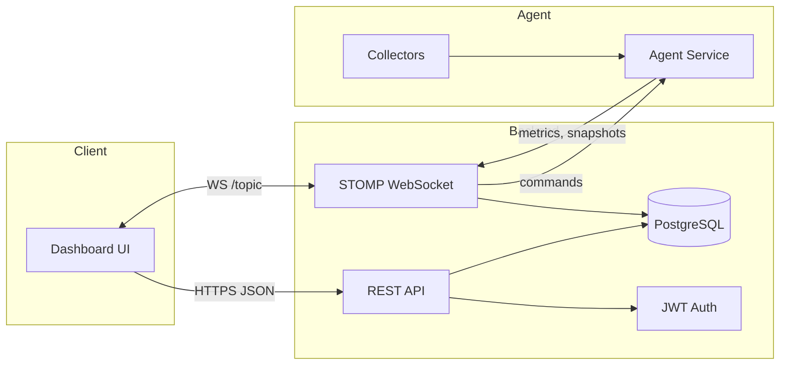

# Monitor Tool

A full-stack monitoring platform with live metrics, detailed system snapshots, and remote command execution.

## Features

- Company signup/login with JWT auth and per-company API tokens
- Agent registration plus device inventory (hostname, IP, OS, last seen)
- Live metrics stream (CPU, memory, disk, network) over STOMP/WebSocket
- Detailed snapshots for processes, connections, services, and logs
- Remote command channel (shell, service control, diagnostics)
- Offline detection with status broadcasts every 30 seconds
- Basic request rate limiting at the API edge

## Architecture

- Backend: Spring Boot 4.0, PostgreSQL, JWT, STOMP/WebSocket
- Frontend: Next.js 16, React 19, TailwindCSS, shadcn/ui
- Agent: Go CLI + service, gopsutil-based collectors

## High-Level Design



## Repository Layout

```
monitor-tool/
├── backend/        # Spring Boot REST + STOMP WebSocket API
├── frontend/       # Next.js dashboard
└── monitor-agent/  # Go agent for metric collection
```

## Quick Start

### 1) Backend

```bash
cd backend
docker compose up --build
```

Runs on http://localhost:8080

To run without Docker:

```bash
cd backend
mvn spring-boot:run
```

### 2) Frontend

```bash
cd frontend
bun install
bun run dev
```

Runs on http://localhost:3000

### 3) Agent

```bash
cd monitor-agent
go build -o monitor-agent ./
./monitor-agent install --token YOUR_TOKEN --server http://localhost:8080
```

## Configuration

### Backend

```env
JWT_SECRET=...
JWT_ISSUER=monitor-tool
JWT_EXP_MINUTES=60
CORS_ALLOWED_ORIGINS=http://localhost:3000
RATE_LIMIT_WINDOW=60
RATE_LIMIT_MAX=120
```

### Frontend

```env
NEXT_PUBLIC_API_BASE=http://localhost:8080
NEXT_PUBLIC_WS_URL=http://localhost:8080/ws
```

### Agent

```env
MONITOR_AGENT_CONFIG=/custom/path/config.json
```

## WebSocket Routes

- Endpoint: /ws (SockJS enabled)
- Topics:
  - /topic/device/{deviceId} (live metrics)
  - /topic/device-status/{deviceId} (ONLINE/OFFLINE)
  - /topic/command-result/{deviceId} (command results)
  - /topic/agent/{deviceId} (commands to agent)
- App destinations:
  - /app/agent/metrics
  - /app/agent/metrics-detail
  - /app/command/{deviceId}
  - /app/command-result

Authentication headers:

- UI: Authorization: Bearer <jwt>
- Agent: x-agent-token: <api token>

See backend/README.md, frontend/README.md, and monitor-agent/README.md for details.

## Development Requirements

- Java 21+
- Node 18+ or Bun 1.0+
- Go 1.22+
