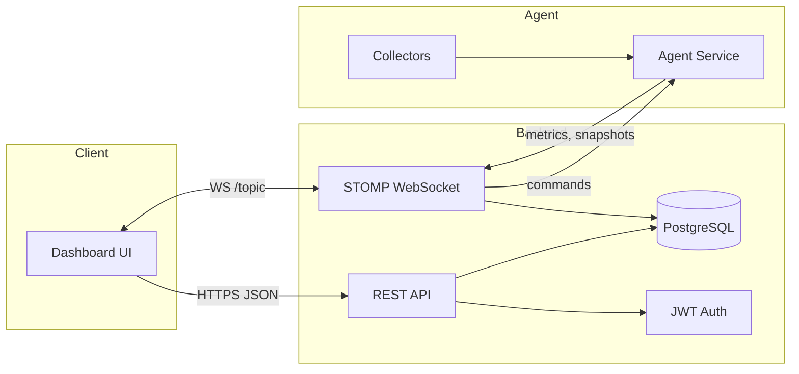
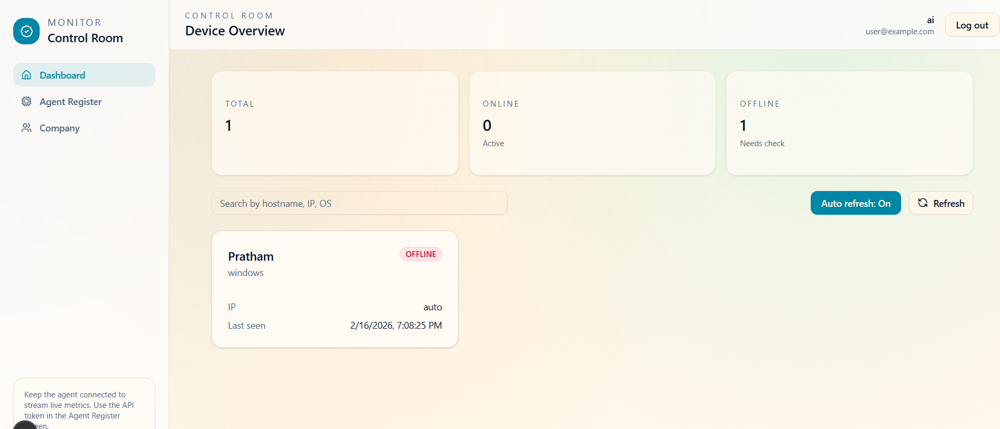

# Monitor Tool

A full-stack monitoring platform with live metrics, detailed system snapshots, and remote command execution.

## Features

- Company signup/login with JWT auth and per-company API tokens
- Agent registration plus device inventory (hostname, IP, OS, last seen)
- Live metrics stream (CPU, memory, disk, network) over STOMP/WebSocket
- Batch metric ingestion over REST and STOMP
- Detailed snapshots: processes, connections, memory, services, and logs
- Remote command channel (shell, service control, diagnostics, collect-details)
- Realtime device status and command result broadcasts
- Offline detection with status broadcasts every 30 seconds
- Basic request rate limiting at the API edge

## Concurrency & Threading

The backend is **multi-threaded** to handle concurrent requests and real-time operations efficiently:

- **Scheduled Tasks**: Uses Spring's `@Scheduled` annotation for background operations
  - Device status checking every 30 seconds (marks offline devices)
  - Metrics aggregation and cleanup via cron jobs
- **Thread-Safe Collections**: `ConcurrentHashMap` for rate limit tracking
- **WebSocket Broadcasting**: Real-time metric streams and status updates to connected clients
- **Spring Boot Servlet Container**: Multi-threaded request handling by default
- **Default Thread Pool**: Elastic scheduling for concurrent task execution

## Architecture

- Backend: Spring Boot 4.0, PostgreSQL, JWT, STOMP/WebSocket
- Frontend: Next.js 16, React 19, TailwindCSS, shadcn/ui
- Agent: Go CLI + service, gopsutil-based collectors

## High-Level Design


```mermaid
flowchart LR
  subgraph Client
    UI[Dashboard UI]
  end

  subgraph Backend
    API[REST API]
    WS[STOMP WebSocket]
    Auth[JWT Auth]
    DB[(PostgreSQL)]
  end

  subgraph Agent
    Collectors[Collectors]
    Runner[Agent Service]
  end

  UI -->|HTTPS JSON| API
  UI <--> |WS /topic| WS
  API --> Auth
  API --> DB
  WS --> DB
  Runner -->|metrics, snapshots| WS
  WS -->|commands| Runner
  Collectors --> Runner
```

## Repository Layout

```
monitor-tool/
├── backend/        # Spring Boot REST + STOMP WebSocket API
├── frontend/       # Next.js dashboard
└── monitor-agent/  # Go agent for metric collection
```

## Quick Start

### 1) Backend

```bash
cd backend
docker compose up --build
```

Runs on http://localhost:8080

To run without Docker:

```bash
cd backend
mvn spring-boot:run
```

### 2) Frontend

```bash
cd frontend
bun install
bun run dev
```

Runs on http://localhost:3000

### 3) Agent

```bash
cd monitor-agent
go build -o monitor-agent ./
./monitor-agent install --token YOUR_TOKEN --server http://localhost:8080
```

## Configuration

### Backend

```env
JWT_SECRET=...
JWT_ISSUER=monitor-tool
JWT_EXP_MINUTES=60
CORS_ALLOWED_ORIGINS=http://localhost:3000
RATE_LIMIT_WINDOW=60
RATE_LIMIT_MAX=120
```

### Frontend

```env
NEXT_PUBLIC_API_BASE=http://localhost:8080
NEXT_PUBLIC_WS_URL=http://localhost:8080/ws
```

### Agent

```env
MONITOR_AGENT_CONFIG=/custom/path/config.json
```

## WebSocket Routes

- Endpoint: /ws (SockJS enabled)
- Topics:
  - /topic/device/{deviceId} (live metrics)
  - /topic/device-status/{deviceId} (ONLINE/OFFLINE)
  - /topic/device-detail/{deviceId} (detailed snapshots)
  - /topic/command-result/{deviceId} (command results)
  - /topic/agent/{deviceId} (commands to agent)
- App destinations:
  - /app/agent/metrics
  - /app/agent/metrics-batch
  - /app/agent/metrics-detail
  - /app/agent/metrics-detail-batch
  - /app/command/{deviceId}
  - /app/command-result

Authentication headers:

- UI: Authorization: Bearer <jwt>
- Agent: x-agent-token: <api token>

See backend/README.md, frontend/README.md, and monitor-agent/README.md for details.

## Version Management

The project uses a unified version source (VERSION file) for all components. See [docs/VERSION_MANAGEMENT.md](docs/VERSION_MANAGEMENT.md) for:

- How versions are managed
- Build and release processes
- CI/CD integration
- Best practices

## Development Requirements

- Java 21+
- Node 18+ or Bun 1.0+
- Go 1.22+

## Documentation

### Reports & PDFs

- [Report 1](public/p1.pdf) | [Download](public/p1.pdf?raw=true)
- [Report 2](public/p2.pdf) | [Download](public/p2.pdf?raw=true)

## Examples




