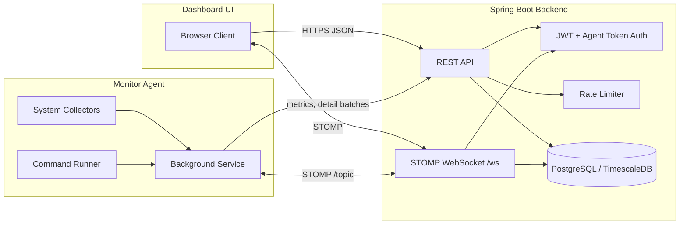
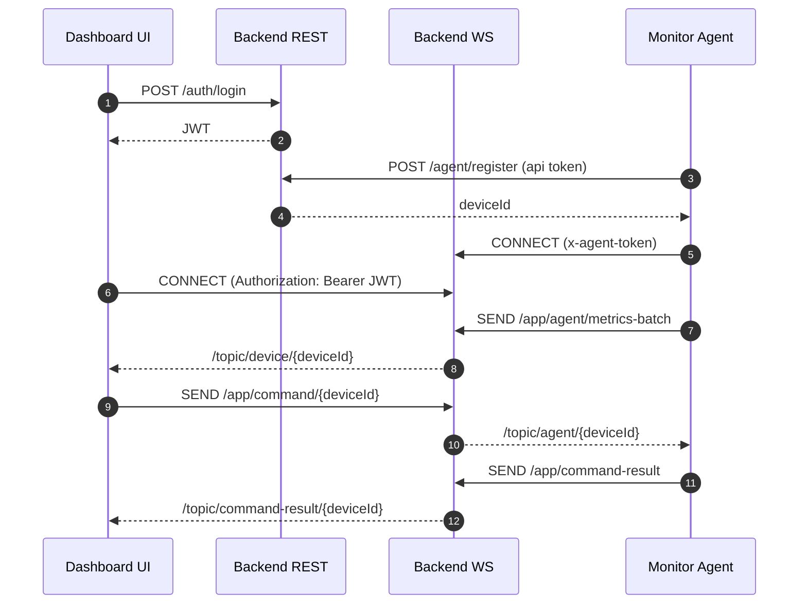

# Monitor Tool

Monitor Tool is a full-stack monitoring platform with live metrics, detailed system snapshots, and remote command execution. It combines a Spring Boot backend, a Next.js dashboard, and a Go agent that runs on monitored machines.

## What you get

- Company accounts with JWT auth and per-company API tokens.
- Device inventory with status tracking and last-seen timestamps.
- Live metrics stream (CPU, memory, disk, network) over STOMP/WebSocket.
- Batch metrics ingestion via REST and STOMP.
- Detailed snapshots (processes, connections, memory, services, logs).
- Remote commands (shell, service control, diagnostics, collect-details).
- Command results streamed back to the dashboard.
- Offline detection and status broadcasts every 30 seconds.
- Basic per-IP/per-path request rate limiting.

## Repository layout

- [backend/](backend/) Spring Boot REST + STOMP WebSocket API
- [frontend/](frontend/) Next.js dashboard
- [monitor-agent/](monitor-agent/) Go agent service and CLI
- [docs/](docs/) Project documentation

## Architecture overview


```mermaid
flowchart LR
  subgraph UI[Dashboard UI]
    Browser[Browser Client]
  end

  subgraph Backend[Spring Boot Backend]
    REST[REST API]
    WS[STOMP WebSocket /ws]
    Auth[JWT + Agent Token Auth]
    Rate[Rate Limiter]
    DB[(PostgreSQL / TimescaleDB)]
  end

  subgraph Agent[Monitor Agent]
    Collector[System Collectors]
    Cmd[Command Runner]
    Service[Background Service]
  end

  Browser -->|HTTPS JSON| REST
  Browser <--> |STOMP| WS
  REST --> Auth
  REST --> Rate
  REST --> DB
  WS --> Auth
  WS --> DB

  Collector --> Service
  Cmd --> Service
  Service -->|metrics, detail batches| REST
  Service <--> |STOMP /topic| WS
```

## Key flows


```mermaid
sequenceDiagram
  autonumber
  participant UI as Dashboard UI
  participant API as Backend REST
  participant WS as Backend WS
  participant Agent as Monitor Agent

  UI->>API: POST /auth/login
  API-->>UI: JWT
  Agent->>API: POST /agent/register (api token)
  API-->>Agent: deviceId
  Agent->>WS: CONNECT (x-agent-token)
  UI->>WS: CONNECT (Authorization: Bearer JWT)
  Agent->>WS: SEND /app/agent/metrics-batch
  WS-->>UI: /topic/device/{deviceId}
  UI->>WS: SEND /app/command/{deviceId}
  WS-->>Agent: /topic/agent/{deviceId}
  Agent->>WS: SEND /app/command-result
  WS-->>UI: /topic/command-result/{deviceId}
```

## Data model (current)

| Entity       | Key fields                                                                        | Notes                          |
| ------------ | --------------------------------------------------------------------------------- | ------------------------------ |
| Company      | id, name, email, passwordHash, apiToken, createdAt                                | Auth and scoping boundary.     |
| Device       | id, hostname, ipAddress, os, status, lastSeenAt, createdAt, company_id            | Updated on every metric batch. |
| Metric       | id, device_id, cpuUsage, memoryUsage, diskUsage, networkIn, networkOut, createdAt | Latest 50 shown in UI.         |
| MetricDetail | id, device_id, detailsJson, createdAt                                             | Latest 20 shown in UI.         |

## REST + WebSocket surface (summary)

REST endpoints (all JSON):

- POST `/auth/register`
- POST `/auth/login`
- GET `/company/me`
- GET `/devices`
- GET `/devices/{deviceId}/metrics`
- GET `/devices/{deviceId}/metrics-detail`
- POST `/agent/register`
- POST `/agent/metrics`
- POST `/agent/metrics/batch`
- POST `/agent/metrics-detail`
- POST `/agent/metrics-detail/batch`

WebSocket (STOMP) endpoint: `/ws`

- Topics: `/topic/device/{deviceId}`, `/topic/device-status/{deviceId}`, `/topic/device-detail/{deviceId}`, `/topic/command-result/{deviceId}`, `/topic/agent/{deviceId}`
- App destinations: `/app/agent/metrics`, `/app/agent/metrics-batch`, `/app/agent/metrics-detail`, `/app/agent/metrics-detail-batch`, `/app/command/{deviceId}`, `/app/command-result`

Authentication:

- UI uses `Authorization: Bearer <jwt>` for REST and STOMP CONNECT.
- Agent uses `x-agent-token: <api token>` for REST and STOMP CONNECT.

## Quick start

### 1) Backend

Docker (recommended for TimescaleDB):

```bash
cd backend
docker compose up --build
```

Local JVM:

```bash
cd backend
mvn spring-boot:run
```

Windows shortcut script: see [backend/run.ps1](backend/run.ps1)

### 2) Frontend

```bash
cd frontend
bun install
bun run dev
```

### 3) Agent

```bash
cd monitor-agent
go build -o monitor-agent ./
./monitor-agent install --token YOUR_TOKEN --server http://localhost:8080
./monitor-agent start
```

## Configuration

Backend environment variables (see [backend/src/main/resources/application.yml](backend/src/main/resources/application.yml)):

```env
JWT_SECRET=...
JWT_ISSUER=monitor-tool
JWT_EXP_MINUTES=60
CORS_ALLOWED_ORIGINS=http://localhost:3000
RATE_LIMIT_WINDOW=60
RATE_LIMIT_MAX=120
METRIC_RETENTION_DAYS=30
METRIC_DETAIL_RETENTION_DAYS=7
```

Frontend environment variables:

```env
NEXT_PUBLIC_API_BASE=http://localhost:8080
NEXT_PUBLIC_WS_URL=http://localhost:8080/ws
```

Agent environment variables:

```env
MONITOR_AGENT_CONFIG=/custom/path/config.json
```

## Retention and background jobs

- Offline detection runs every 30 seconds.
- TimescaleDB hypertables and retention policies are enabled when the extension is available; otherwise a daily cleanup job runs at 02:30.
- Default retention: metrics 30 days, detailed metrics 7 days.

## Documentation

- [docs/SYSTEM_DESIGN.md](docs/SYSTEM_DESIGN.md)
- [docs/SECURITY.md](docs/SECURITY.md)
- [docs/VERSION_MANAGEMENT.md](docs/VERSION_MANAGEMENT.md)

## Reports

- [public/p1.pdf](public/p1.pdf)
- [public/p2.pdf](public/p2.pdf)

## Screenshots


