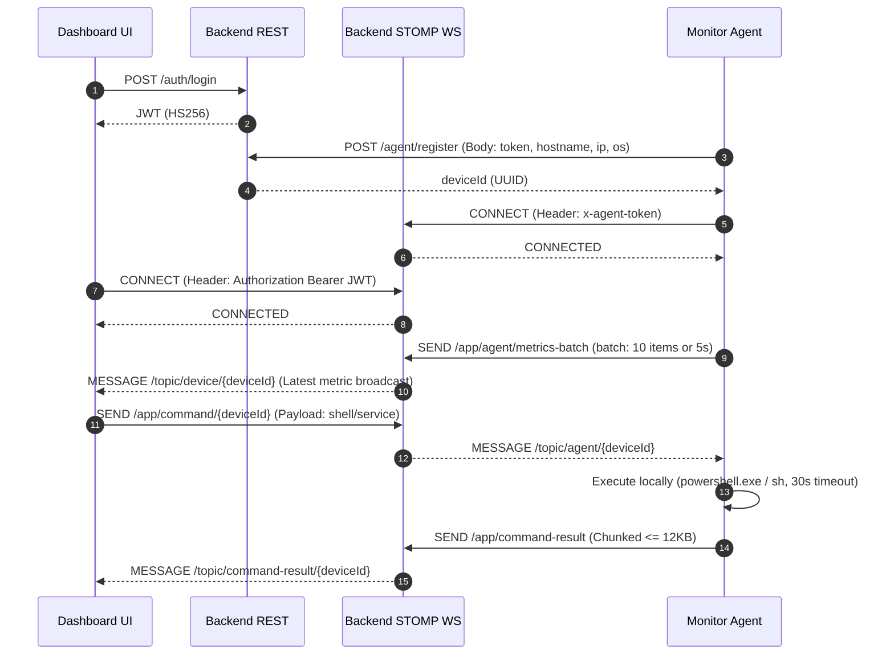
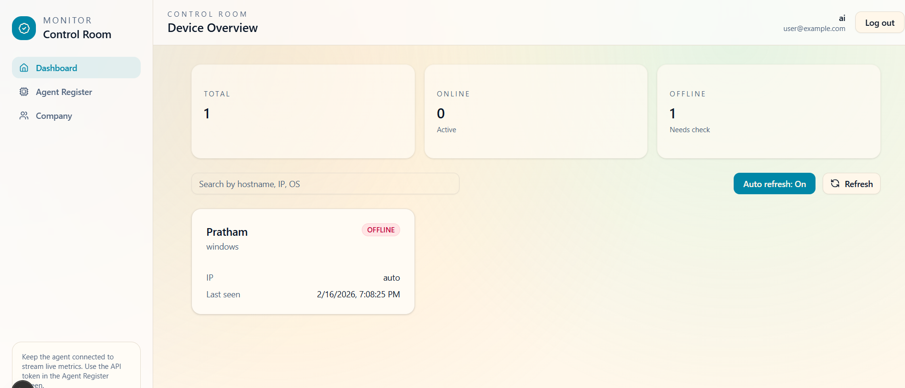

# Monitor Agent & Fleet Management Platform

Monitor Agent is an end-to-end multi-tenant infrastructure monitoring platform featuring live time-series telemetry streaming, deep diagnostic system snapshots, and bi-directional remote command execution. It couples a Spring Boot 4.0.2 / Java 21 backend with TimescaleDB time-series storage, a Next.js 16 (React 19) dashboard, a native Go daemon/CLI agent, and a high-concurrency simulation load tester.

---

## Technical Documentation Suite

The complete code-first technical documentation and architectural reverse-engineering reference is maintained in the [`docs/`](docs/) directory:

| Document | Primary Focus |
| :--- | :--- |
| [**System Overview**](docs/system-overview.md) | High-level system architecture, subsystem inventory, and core invariants. |
| [**System Architecture**](docs/architecture.md) | Full architectural diagrams, process models, and trust boundaries. |
| [**Execution Traces**](docs/execution-traces.md) | **Concrete end-to-end traces** for metric collection, failures, commands, and sweeps. |
| [**Go Monitor Agent**](docs/go-agent.md) | Internal agent engine, gopsutil collectors, adaptive loop, and STOMP client. |
| [**Go CLI Reference**](docs/cli.md) | Comprehensive reference for Cobra CLI commands, flags, and exit codes. |
| [**Spring Boot Backend**](docs/spring-boot-backend.md) | Controller forensics, services, security filters, and TimescaleDB initialization. |
| [**Next.js Frontend**](docs/nextjs-frontend.md) | React 19 state, SockJS/STOMP streaming, and multi-chunk command reassembly. |
| [**Data Flow & Lineage**](docs/data-flow.md) | End-to-end metric transformation from OS kernel counters to SVG chart rendering. |
| [**Networking & Protocols**](docs/networking.md) | Protocols, STOMP framing, transport buffer limits, and dual WebSocket topology. |
| [**Batching & Rate Limiting**](docs/batching-and-rate-limiting.md) | Thresholds, memory ownership, edge rate limiting, and exemption rules. |
| [**Concurrency & Threading**](docs/concurrency.md) | Goroutines, thread pools, race condition analysis, and synchronization hazards. |
| [**Database & TimescaleDB**](docs/database.md) | Schema ERD, hypertable partition mechanics, query patterns, and idempotency. |
| [**API & Protocol Reference**](docs/api-reference.md) | Exhaustive REST endpoint contracts and STOMP topic/destination specifications. |
| [**Configuration Reference**](docs/configuration.md) | Environment variables, YAML keys, agent JSON configs, and default values. |
| [**Failure Recovery & Resilience**](docs/failure-recovery.md) | Failure matrix, crash consistency boundaries, timeouts, and backoff policies. |
| [**Observability & Monitoring**](docs/observability.md) | Logging forensics, health checks, operational questions, and monitoring gaps. |
| [**Security & Vulnerability Audit**](docs/security.md) | Threat modeling, BOLA vulnerability audit, and remediation guidance. |
| [**Performance & Scalability**](docs/performance.md) | CPU/memory profiles, database write capacity, and 1 to 10,000 node modeling. |
| [**Testing & Verification**](docs/testing.md) | Test suite inventory, gaps, and `loadtester/` simulation harness analysis. |
| [**Operational Troubleshooting**](docs/troubleshooting.md) | Diagnostic symptom-resolution matrix and verification runbooks. |
| [**Architecture Decision Records**](docs/architecture-decisions.md) | ADR-01 through ADR-05 reverse-engineered directly from source. |

---

## Actual System Architecture

```mermaid
flowchart LR
  subgraph UI[Dashboard UI - Next.js 16]
    Browser[Browser Client]
  end

  subgraph Backend[Spring Boot Backend]
    REST[REST API - /auth, /company, /devices, /agent]
    WS[STOMP WebSocket Broker - /ws]
    Auth[JWT Filter + WebSocketAuthInterceptor]
    Rate[RateLimitFilter - Exempts /agent & /ws]
    DB[(PostgreSQL 16 / TimescaleDB)]
    Scheduler[DeviceStatusScheduler - 30s Fixed Rate]
  end

  subgraph Agent[Monitor Agent - Go]
    MetricsLoop[Metrics WS Loop - Adaptive 1-5s]
    DetailLoop[Detail REST Loop - 30s Interval]
    CmdLoop[Command WS Loop - Shell/Service Control]
  end

  Browser -->|HTTPS JSON - Bearer JWT| REST
  Browser <-->|STOMP SockJS - /topic, /app| WS
  REST --> Auth
  REST --> Rate
  REST --> DB
  WS --> Auth
  WS --> DB
  Scheduler --> DB
  Scheduler -.->|Broadcast OFFLINE status| WS

  MetricsLoop <-->|STOMP SEND /app/agent/metrics-batch| WS
  CmdLoop <-->|STOMP SUB /topic/agent, SEND /app/command-result| WS
  DetailLoop -->|HTTP POST /agent/metrics-detail/batch (x-agent-token)| REST
```

---

## Key Runtime Flows


```mermaid
sequenceDiagram
  autonumber
  participant UI as Dashboard UI
  participant API as Backend REST
  participant WS as Backend STOMP WS
  participant Agent as Monitor Agent

  UI->>API: POST /auth/login
  API-->>UI: JWT (HS256)
  Agent->>API: POST /agent/register (Body: token, hostname, ip, os)
  API-->>Agent: deviceId (UUID)
  Agent->>WS: CONNECT (Header: x-agent-token)
  WS-->>Agent: CONNECTED
  UI->>WS: CONNECT (Header: Authorization Bearer JWT)
  WS-->>UI: CONNECTED
  Agent->>WS: SEND /app/agent/metrics-batch (batch: 10 items or 5s)
  WS-->>UI: MESSAGE /topic/device/{deviceId} (Latest metric broadcast)
  UI->>WS: SEND /app/command/{deviceId} (Payload: shell/service)
  WS-->>Agent: MESSAGE /topic/agent/{deviceId}
  Agent->>Agent: Execute locally (powershell.exe / sh, 30s timeout)
  Agent->>WS: SEND /app/command-result (Chunked <= 12KB)
  WS-->>UI: MESSAGE /topic/command-result/{deviceId}
```

---

## Repository Layout

- [`backend/`](backend/) Spring Boot 4.0.2 REST + STOMP WebSocket API & TimescaleDB storage.
- [`frontend/`](frontend/) Next.js 16.1.6 dashboard with React 19 & Tailwind CSS v4.
- [`monitor-agent/`](monitor-agent/) Go monitoring agent daemon and Cobra CLI suite.
- [`loadtester/`](loadtester/) High-concurrency agent simulator and benchmarking suite.
- [`scripts/`](scripts/) Build, cross-compilation, version bump, and installation scripts.
- [`docs/`](docs/) Definitive technical documentation suite.

---

## Quick Start

### 1) Backend (Docker Compose with TimescaleDB)

```bash
cd backend
docker compose up --build
```
Or locally via Maven:
```bash
cd backend
./mvnw spring-boot:run
```

### 2) Frontend (Next.js Dashboard)

```bash
cd frontend
bun install
bun run dev
```
Dashboard will be accessible at `http://localhost:3000`.

### 3) Monitor Agent (Go)

```bash
cd monitor-agent
go build -o monitor-agent .
./monitor-agent install --token <YOUR_COMPANY_TOKEN> --server http://localhost:8080
./monitor-agent start
```
Or run directly in foreground for debugging:
```bash
./monitor-agent run
```

---

## Screenshots

\n