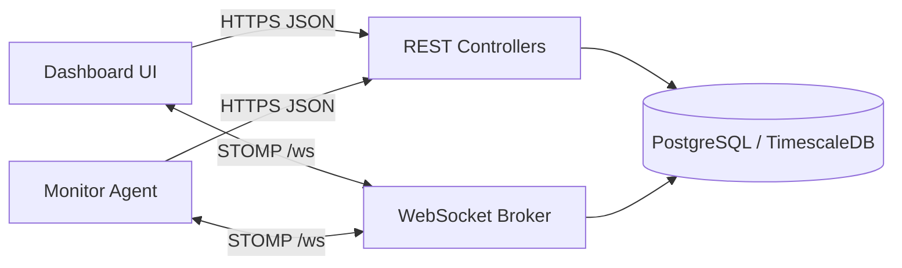

# Monitor Tool Backend

Spring Boot backend for the monitoring platform. It exposes REST APIs, STOMP/WebSocket streams, device status tracking, command routing, and metric retention management.

## Runtime requirements

- Java 21
- Maven 3.9+
- PostgreSQL 16 (TimescaleDB optional)

## High-level flow



## Run locally

```bash
mvn spring-boot:run
```

Runs on `http://localhost:8080`.

## Run with Docker

```bash
docker compose up --build
```

This starts PostgreSQL (Timescale image) and the backend. See [docker-compose.yml](docker-compose.yml).

## REST API (current)

Authentication:

- UI endpoints require `Authorization: Bearer <jwt>`.
- Agent endpoints require `x-agent-token: <api token>`.

### Auth and company

| Method | Path             | Auth | Description                            |
| ------ | ---------------- | ---- | -------------------------------------- |
| POST   | `/auth/register` | none | Create company, returns API token.     |
| POST   | `/auth/login`    | none | Returns JWT.                           |
| GET    | `/company/me`    | JWT  | Returns company profile and API token. |

Example login request:

```json
{ "email": "ops@company.com", "password": "your-password" }
```

Example login response:

```json
{ "token": "<jwt>" }
```

### Devices and metrics

| Method | Path                                 | Auth | Description                   |
| ------ | ------------------------------------ | ---- | ----------------------------- |
| GET    | `/devices`                           | JWT  | List devices for the company. |
| GET    | `/devices/{deviceId}/metrics`        | JWT  | Latest 50 metric samples.     |
| GET    | `/devices/{deviceId}/metrics-detail` | JWT  | Latest 20 detailed snapshots. |

### Agent ingestion

| Method | Path                          | Auth      | Description                 |
| ------ | ----------------------------- | --------- | --------------------------- |
| POST   | `/agent/register`             | API token | Register or refresh device. |
| POST   | `/agent/metrics`              | API token | Single metric sample.       |
| POST   | `/agent/metrics/batch`        | API token | Metric batch.               |
| POST   | `/agent/metrics-detail`       | API token | Single detailed snapshot.   |
| POST   | `/agent/metrics-detail/batch` | API token | Detailed snapshot batch.    |

Example register request:

```json
{
  "token": "<api token>",
  "hostname": "agent-01",
  "ipAddress": "10.0.0.5",
  "os": "linux"
}
```

Example metric batch payload:

```json
[
  {
    "deviceId": "<uuid>",
    "cpuUsage": 32.2,
    "memoryUsage": 62.1,
    "diskUsage": 51.3,
    "networkIn": 104857,
    "networkOut": 20480
  }
]
```

## WebSocket (STOMP) API

Endpoint: `/ws` (SockJS enabled)

Topics (server -> client):

- `/topic/device/{deviceId}` latest metric sample
- `/topic/device-status/{deviceId}` `ONLINE` or `OFFLINE`
- `/topic/device-detail/{deviceId}` latest detailed snapshot
- `/topic/command-result/{deviceId}` command results
- `/topic/agent/{deviceId}` commands for agent

App destinations (client -> server):

- `/app/agent/metrics`
- `/app/agent/metrics-batch`
- `/app/agent/metrics-detail`
- `/app/agent/metrics-detail-batch`
- `/app/command/{deviceId}`
- `/app/command-result`

WebSocket authentication happens on CONNECT. The interceptor accepts either a JWT (`Authorization: Bearer`) or agent token (`x-agent-token`).

## Device status and streaming

- Metrics ingestion updates `lastSeenAt` and sets status to `ONLINE`.
- Offline detection runs every 30 seconds; devices inactive for >30 seconds are marked `OFFLINE` and broadcasted.
- Live metrics are broadcast to `/topic/device/{deviceId}` whenever a metric is saved.
- Detailed snapshots are broadcast to `/topic/device-detail/{deviceId}` on ingest.

## Retention and storage

- On startup, the backend tries to enable TimescaleDB hypertables and retention policies.
- Defaults: metrics 30 days, detailed metrics 7 days.
- If TimescaleDB is not available, a daily scheduled cleanup (02:30) deletes old rows.

## Rate limiting

- A basic per-IP/per-path limiter is applied to all requests.
- Configurable window and max requests via environment variables.

## Configuration

Defaults are defined in [src/main/resources/application.yml](src/main/resources/application.yml).

```env
JWT_SECRET=...
JWT_ISSUER=monitor-tool
JWT_EXP_MINUTES=60
CORS_ALLOWED_ORIGINS=http://localhost:3000
RATE_LIMIT_WINDOW=60
RATE_LIMIT_MAX=120
METRIC_RETENTION_DAYS=30
METRIC_DETAIL_RETENTION_DAYS=7
```

## Data model summary

| Entity       | Fields                                                                            |
| ------------ | --------------------------------------------------------------------------------- |
| Company      | id, email, name, passwordHash, apiToken, createdAt                                |
| Device       | id, hostname, ipAddress, os, status, lastSeenAt, createdAt, company_id            |
| Metric       | id, device_id, cpuUsage, memoryUsage, diskUsage, networkIn, networkOut, createdAt |
| MetricDetail | id, device_id, detailsJson, createdAt                                             |

## Security notes (current)

- JWT is required for company endpoints; agent endpoints are scoped by `x-agent-token`.
- WebSocket CONNECT validates credentials and binds company identity to the session.
- No MFA or RBAC is implemented in the current code.

## Helpful docs

- [docs/SYSTEM_DESIGN.md](../docs/SYSTEM_DESIGN.md)
- [docs/SECURITY.md](../docs/SECURITY.md)
