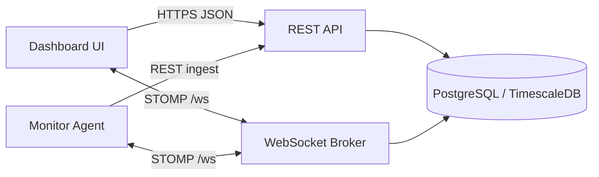
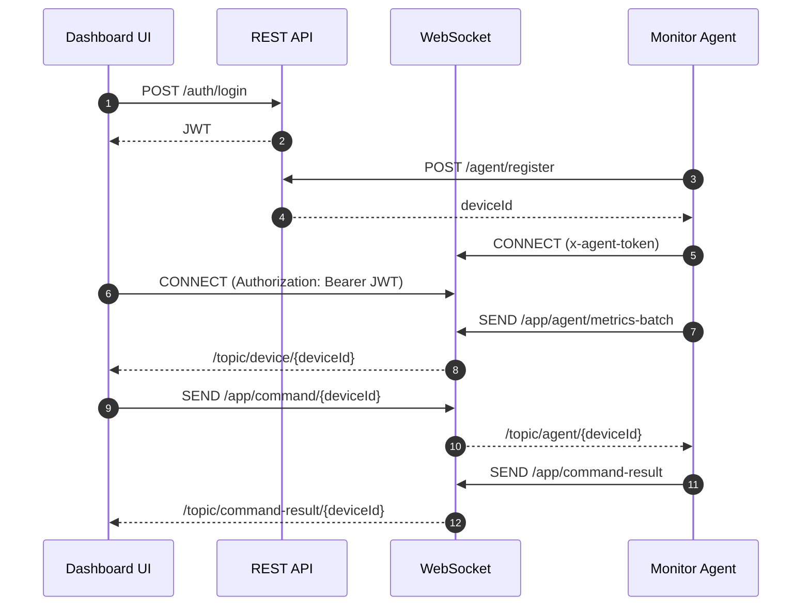

# System Design

This document describes the current system design, scale expectations based on code defaults, operational cost drivers, and scaling options.

## Current architecture

- Frontend: Next.js dashboard for authentication, device inventory, live metrics, detailed snapshots, and commands.
- Backend: Spring Boot REST API + STOMP WebSocket broker with JWT auth and rate limiting.
- Database: PostgreSQL storing companies, devices, metrics, and detailed snapshots.
- Agent: Go service that registers devices, streams metrics, collects detailed snapshots, and executes remote commands.

## Runtime flows

## Technologies used

- Backend: Java 21, Spring Boot, STOMP/WebSocket, JWT, PostgreSQL
- Frontend: Next.js, React, Tailwind CSS, shadcn/ui
- Agent: Go, gopsutil, gorilla/websocket, kardianos/service

## Current scale expectations (based on defaults)

These are conservative, code-based expectations for a single backend instance:

- Metric sampling is adaptive, with a minimum 1-5 second interval and batch size of 10.
- Detailed snapshots are sent every 30 seconds by default.
- Metrics are persisted and broadcast on each batch flush.

A reasonable baseline for a single-node deployment:

- ~500-2,000 devices per backend instance at low to moderate traffic.
- ~5-20k metrics per minute total, depending on CPU load patterns.
- Detailed snapshot payloads are the main bandwidth and storage driver.

These values are estimates; validate with load tests.

## Storage and retention

- On startup, the backend attempts to enable TimescaleDB hypertables and retention policies.
- Defaults: metrics 30 days, detailed metrics 7 days.
- If TimescaleDB is not available, a daily cleanup job deletes old rows.

## Cost drivers

- Database storage and IOPS for metrics and detailed snapshots.
- WebSocket connection count and fan-out on the backend.
- Bandwidth for detailed snapshots, especially logs and services output.

Practical cost controls:

- Reduce detailed snapshot frequency or payload size.
- Tune retention policies for metrics and snapshots.
- Compression at the WebSocket or proxy layer.

## Scaling strategy (current stack)

### Backend

- Add horizontal replicas behind a load balancer.
- Use sticky sessions or a shared message broker if required for WS routing.
- Consider external STOMP broker (RabbitMQ) for higher fan-out.
- Move rate limiting to API gateway for centralized policy.

### Database

- Add indexes on deviceId and createdAt for metrics and details.
- Partition tables by time (weekly/monthly) for retention.
- Use read replicas for dashboard queries.

### Agent

- Stagger detailed metrics intervals per device to reduce burst load.
- Keep adaptive sampling to reduce spikes at scale.

### Frontend

- Use pagination or windowing for large device lists.
- Cache metrics and details in the API layer if needed.

## Operational scaling checklist

- Add health checks, liveness probes, and autoscaling rules.
- Centralize logging and metrics for backend and agents.
- Implement retention policies (TTL) for metrics and details.
- Add request tracing for command and snapshot flows.

## Potential improvements (optional)

- Replace in-memory rate limiter with Redis-based limiter.
- Use Kafka or NATS for metrics ingestion.
- Move STOMP broker to RabbitMQ for large fan-out.
- Add TimescaleDB or ClickHouse for metrics storage.
- Add S3-compatible storage for large log snapshots.

## If changing languages or infra (optional)

- Backend: Go or Node.js with a dedicated WS gateway.
- DB: TimescaleDB for time-series data or ClickHouse for analytics.
- Infra: Kubernetes for autoscaling and rolling updates.
- Agent: Add gRPC streaming for lower overhead.

## Notes

- These recommendations assume current code behavior and no production load testing.
- Validate with realistic device counts and payload sizes.
