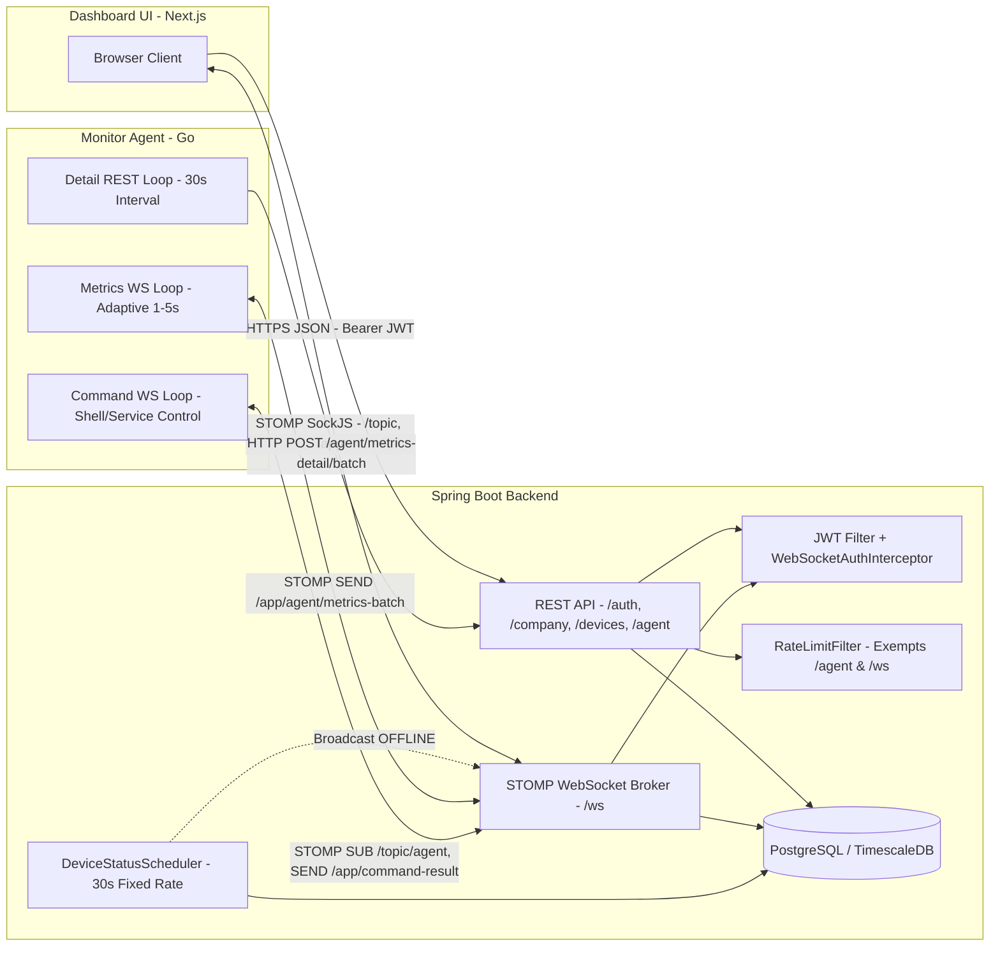
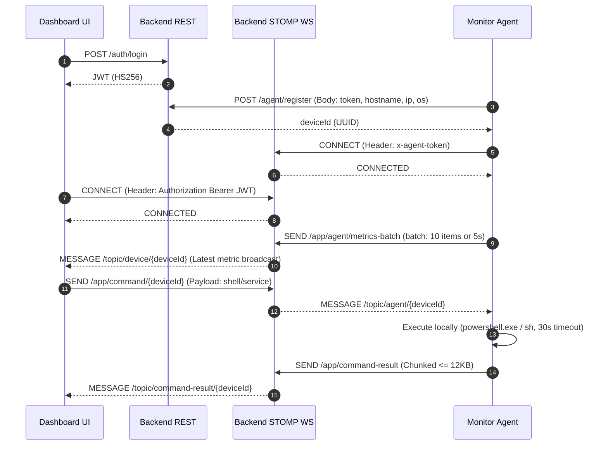

# System Design & Architecture Analysis

> **Notice**: This document has been updated following a complete source code audit. For the definitive, file-by-file forensic documentation suite, see:
> - [System Overview](system-overview.md)
> - [System Architecture](architecture.md)
> - [End-to-End Execution Traces](execution-traces.md)
> - [Go Monitor Agent](go-agent.md)
> - [Cobra CLI Reference](cli.md)
> - [Spring Boot Backend](spring-boot-backend.md)
> - [Next.js Frontend](nextjs-frontend.md)
> - [Batching & Rate Limiting](batching-and-rate-limiting.md)
> - [Concurrency & Threading](concurrency.md)
> - [Database & TimescaleDB](database.md)
> - [Security & Vulnerability Audit](security.md)
> - [API & Protocol Reference](api-reference.md)

---

## Documentation Corrections

The following table records discrepancies between previously claimed behaviors in old documentation and the actual verified implementation in the current source code:

| Old Claim / Assumption | Current Implementation (Verified from Code) | Required Correction |
| :--- | :--- | :--- |
| **Claim**: Agent sends metrics batches over REST (`Agent -->|REST ingest| API`). | Metrics batches are transmitted exclusively over **WebSocket STOMP** (`/app/agent/metrics-batch`). REST ingest is only used for device registration and 30-second detailed snapshots (`/agent/metrics-detail/batch`). | Clarify that the agent maintains dual concurrent WebSocket connections and uses REST only for registration and snapshots. |
| **Claim**: Rate limiting protects all backend API endpoints. | `RateLimitFilter.shouldNotFilter()` explicitly **exempts** `/agent`, `/agent/*`, `/ws`, and `/ws/*`. Furthermore, requests with header `X-Load-Tester: true` or User-Agent `monitor-loadtester/*` completely bypass rate limiting. | Document that edge rate limiting only applies to `/auth/*`, `/devices/*`, and `/company/*`. |
| **Claim**: Agent WebSocket connects to `/topic/agent/{deviceId}`. | The agent **subscribes** (`SUBSCRIBE`) to `/topic/agent/{deviceId}` to receive commands, but **publishes** (`SEND`) to `/app/command-result` and `/app/agent/metrics-batch`. | Clarify STOMP application destination prefixes (`/app`) vs broker topic prefixes (`/topic`). |
| **Claim**: Ingested monitoring data is safe from duplication. | Metric and detail ingestion transactions are **non-idempotent**. When the backend receives a batch, it generates a new server timestamp (`Instant.now()`) for all records and executes standard SQL `INSERT`s without natural key deduplication. | Document that re-transmitted batches create duplicate rows in the database. |
| **Claim**: Device offline detection is event-driven. | Device offline detection is driven by a scheduled polling background job (`DeviceStatusScheduler`) executing `deviceRepository.findAll()` every 30 seconds. | Document the full-table scan behavior and potential scaling bottleneck. |

---

## Current Architecture

```mermaid
flowchart LR
    subgraph UI[Dashboard UI - Next.js]
        Browser[Browser Client]
    end

    subgraph Backend[Spring Boot Backend]
        REST[REST API - /auth, /company, /devices, /agent]
        WS[STOMP WebSocket Broker - /ws]
        Auth[JWT Filter + WebSocketAuthInterceptor]
        Rate[RateLimitFilter - Exempts /agent & /ws]
        Scheduler[DeviceStatusScheduler - 30s Fixed Rate]
        DB[(PostgreSQL / TimescaleDB)]
    end

    subgraph Agent[Monitor Agent - Go]
        MetricsLoop[Metrics WS Loop - Adaptive 1-5s]
        DetailLoop[Detail REST Loop - 30s Interval]
        CmdLoop[Command WS Loop - Shell/Service Control]
    end

    Browser -->|HTTPS JSON - Bearer JWT| REST
    Browser <-->|STOMP SockJS - /topic, /app| WS
    REST --> Auth
    REST --> Rate
    REST --> DB
    WS --> Auth
    WS --> DB
    Scheduler --> DB
    Scheduler -.->|Broadcast OFFLINE| WS

    MetricsLoop <-->|STOMP SEND /app/agent/metrics-batch| WS
    CmdLoop <-->|STOMP SUB /topic/agent, SEND /app/command-result| WS
    DetailLoop -->|HTTP POST /agent/metrics-detail/batch| REST
```

---

## Runtime Flows

```mermaid
sequenceDiagram
    autonumber
    participant UI as Dashboard UI
    participant API as Backend REST
    participant WS as Backend STOMP WS
    participant Agent as Monitor Agent

    UI->>API: POST /auth/login
    API-->>UI: JWT (HS256)
    Agent->>API: POST /agent/register (Body: token, hostname, ip, os)
    API-->>Agent: deviceId (UUID)
    Agent->>WS: CONNECT (Header: x-agent-token)
    WS-->>Agent: CONNECTED
    UI->>WS: CONNECT (Header: Authorization Bearer JWT)
    WS-->>UI: CONNECTED
    Agent->>WS: SEND /app/agent/metrics-batch (batch: 10 items or 5s)
    WS-->>UI: MESSAGE /topic/device/{deviceId} (Latest metric broadcast)
    UI->>WS: SEND /app/command/{deviceId} (Payload: shell/service)
    WS-->>Agent: MESSAGE /topic/agent/{deviceId}
    Agent->>Agent: Execute locally (powershell.exe / sh, 30s timeout)
    Agent->>WS: SEND /app/command-result (Chunked <= 12KB)
    WS-->>UI: MESSAGE /topic/command-result/{deviceId}
```

---

## Scale Expectations & Baseline Limits (Code-Verified)

- **Metric Sampling**: Adaptive (1s if CPU > 90%, 2s if CPU > 70%, 5s default). Flushes at 10 items or 5 seconds.
- **Detailed Snapshots**: 30-second interval via HTTP POST. Payload sizes range between 150KB and 500KB.
- **Single-Node Baseline**:
  - ~500–1,000 devices per single backend node.
  - Bottlenecks: `DeviceStatusScheduler` executes `findAll()` on every tick; TimescaleDB IOPS and disk storage growth for uncompressed detail snapshots.\n