# System Architecture & Component Interactions

## 1. Architectural Model & Component Relationships

The actual architecture reconstructed directly from source code divides the system into three main host domains: the Monitored Host (Go Agent), the Monitoring Server (Spring Boot + PostgreSQL/TimescaleDB), and the Client Workstation (Next.js Dashboard).

```mermaid
flowchart TB
    subgraph BrowserDomain["Client Workstation / Operator Browser"]
        NextClient["Next.js React Client (App Router)"]
        LocalStorage[("Browser LocalStorage\n- monitor.jwt\n- monitor.company")]
        NextClient <--> LocalStorage
    end

    subgraph ServerDomain["Monitoring Server Domain"]
        subgraph IngressFilters["Servlet Filter Chain"]
            RateLimit["RateLimitFilter\n(120 req / 60s per IP+URI)\n*Exempts /agent, /ws, X-Load-Tester*"]
            JwtAuth["JwtFilter\n(Validates Bearer token on /devices, /company)"]
            RateLimit --> JwtAuth
        end

        subgraph SpringControllers["Spring Boot WebMvc & WebSocket"]
            AuthController["AuthController\nPOST /auth/register\nPOST /auth/login"]
            CompanyController["CompanyController\nGET /company/me"]
            DeviceController["DeviceController\nGET /devices\nGET /devices/{id}/metrics\nGET /devices/{id}/metrics-detail"]
            AgentController["AgentController (REST Ingest)\nPOST /agent/register\nPOST /agent/metrics\nPOST /agent/metrics/batch\nPOST /agent/metrics-detail\nPOST /agent/metrics-detail/batch"]
            
            WSAuth["WebSocketAuthInterceptor\n(STOMP CONNECT Auth)"]
            AgentWSCtrl["AgentWebSocketController\n/app/agent/metrics\n/app/agent/metrics-batch\n/app/agent/metrics-detail\n/app/agent/metrics-detail-batch"]
            CmdWSCtrl["CommandWebSocketController\n/app/command/{deviceId}\n/app/command-result"]
            SimpleBroker["Spring In-Memory SimpleBroker\n/topic/device/{id}\n/topic/device-status/{id}\n/topic/device-detail/{id}\n/topic/command-result/{id}\n/topic/agent/{id}"]
        end

        subgraph BackgroundJobs["Background Async Tasks"]
            StatusScheduler["DeviceStatusScheduler\n(Runs every 30s: sweeps devices, marks OFFLINE)"]
            StorageRetention["MetricsStorageService\n(TimescaleDB / Fallback Cron 02:30 UTC)"]
        end

        subgraph SpringServices["Spring Boot Service Layer"]
            AuthSvc["AuthService\n(BCrypt password encoding, JWT issuance)"]
            JwtSvc["JwtService\n(HS256 HMAC JWT verification)"]
            DeviceSvc["DeviceService\n(Device listing, metric queries, 5s detail cache)"]
            AgentSvc["AgentService\n(Device upsert, batch persistence, status updates, WS broadcast)"]
        end

        subgraph DB["PostgreSQL 16 / TimescaleDB"]
            CompanyTbl[("company")]
            DeviceTbl[("device")]
            MetricTbl[("metric (Hypertable)")]
            DetailTbl[("metric_detail (Hypertable)")]
        end
    end

    subgraph AgentDomain["Monitored Target Host"]
        subgraph LocalOS["Operating System Subsystems"]
            ProcSubsystem["Processes (gopsutil)"]
            NetSubsystem["Network Sockets (gopsutil net)"]
            MemSubsystem["Virtual Memory & Swap (gopsutil mem)"]
            DiskSubsystem["Root / Drive Space (gopsutil disk)"]
            CPUSubsystem["CPU Percent (gopsutil cpu)"]
            SysServices["OS Service Manager\n(sc.exe / systemctl / launchctl)"]
            SysLogs["OS Event Log / Journal\n(wevtutil / journalctl / log)"]
        end

        subgraph AgentProcess["Go Monitor Agent Process"]
            AgentConfig[("config.json\nserverUrl, token, deviceId")]
            WorkerSupervisor["Worker Supervisor / kardianos.Service"]
            
            MetricsWSWorker["Metrics WebSocket Worker\n- Adaptive interval: 1s-5s\n- Batch: 10 items or 5s\n- STOMP SEND /app/agent/metrics-batch"]
            DetailRESTWorker["Detail REST Worker\n- Interval: 30s\n- Batch: 1 item or 30s\n- HTTP POST /agent/metrics-detail/batch"]
            CmdWSWorker["Command WebSocket Worker\n- STOMP SUB /topic/agent/{deviceId}\n- Shell/Service Executor (30s timeout)\n- STOMP SEND /app/command-result"]
            RegHeartbeatWorker["Registration Worker\n- Background registration retry loop\n- 20s local heartbeat log"]
        end
    end

    %% Wiring
    NextClient -- "1. POST /auth/login\n(Receive Bearer JWT)" --> RateLimit --> AuthController --> AuthSvc --> CompanyTbl
    NextClient -- "2. GET /devices\n(Bearer JWT)" --> RateLimit --> JwtAuth --> DeviceController --> DeviceSvc --> DeviceTbl
    NextClient -- "3. GET /devices/{id}/metrics[-detail]" --> RateLimit --> JwtAuth --> DeviceController --> DeviceSvc --> MetricTbl & DetailTbl
    
    NextClient <== "4. STOMP CONNECT\nHeader: Authorization Bearer JWT\nSUB: /topic/device/{id}, /topic/device-status/{id},\n/topic/device-detail/{id}, /topic/command-result/{id}\nSEND: /app/command/{id}" ==> WSAuth <==> SimpleBroker

    AgentProcess <--> AgentConfig
    WorkerSupervisor --> RegHeartbeatWorker
    WorkerSupervisor --> MetricsWSWorker
    WorkerSupervisor --> DetailRESTWorker
    WorkerSupervisor --> CmdWSWorker

    MetricsWSWorker --> CPUSubsystem & MemSubsystem & DiskSubsystem & NetSubsystem
    DetailRESTWorker --> ProcSubsystem & NetSubsystem & MemSubsystem & SysServices & SysLogs
    CmdWSWorker --> SysServices

    RegHeartbeatWorker -- "5. POST /agent/register\nPayload: {token, hostname, ip, os}" --> AgentController --> AgentSvc --> DeviceTbl
    DetailRESTWorker -- "6. POST /agent/metrics-detail/batch\nHeader: x-agent-token" --> AgentController --> AgentSvc --> DetailTbl & SimpleBroker
    
    MetricsWSWorker <== "7. STOMP CONNECT (x-agent-token)\nSend: /app/agent/metrics-batch" ==> WSAuth <==> SimpleBroker <--> AgentWSCtrl --> AgentSvc --> MetricTbl & SimpleBroker
    CmdWSWorker <== "8. STOMP CONNECT (x-agent-token)\nSub: /topic/agent/{id}\nSend: /app/command-result" ==> WSAuth <==> SimpleBroker <--> CmdWSCtrl
    
    SimpleBroker -. "Broadcast metric\n/topic/device/{id}" .-> NextClient
    SimpleBroker -. "Broadcast status\n/topic/device-status/{id}" .-> NextClient
    SimpleBroker -. "Broadcast detail\n/topic/device-detail/{id}" .-> NextClient
    SimpleBroker -. "Broadcast command result\n/topic/command-result/{id}" .-> NextClient
    SimpleBroker -. "Forward command\n/topic/agent/{id}" .-> CmdWSWorker

    StatusScheduler --> DeviceTbl & SimpleBroker
    StorageRetention --> MetricTbl & DetailTbl
```



---

## 2. Process Architecture & Execution Topology

### Go Agent Process Architecture
- **Single OS Binary**: Executable can be installed as an OS daemon (`systemd` unit on Linux, Windows Service via Service Control Manager `sc.exe`, or `launchd` plist on macOS) via `kardianos/service`.
- **Runtime Goroutine Pool**:
  1. Main execution thread: Monitors OS signals (`SIGINT`, `SIGTERM`), handles Cobra CLI routing if interactive, or initializes service logger and triggers `kardianos/service.Run()`.
  2. `MetricsWebSocketLoop`: Handles STOMP WebSocket dial, connection upkeep, metric sampling, adaptive throttling, batch queuing, and batch flushing.
  3. `DetailedMetricsLoop`: Handles heavyweight system collection every 30s and HTTP POST batch transmission.
  4. `CommandLoop`: Maintains persistent STOMP WebSocket subscription to `/topic/agent/{deviceId}`, listens for commands, spawns execution sub-threads, chunks large responses (<=12KB per chunk), and writes output frames back to `/app/command-result`.
  5. `Registration Retry Loop`: Independent worker checking `cfg.DeviceID == ""` every 15s and executing `RegisterIfNeeded()`.
  6. `Heartbeat Logging Goroutine`: Logs local agent heartbeat every 20s to file and stdout.

### Spring Boot Backend Process Architecture
- **Embedded Tomcat / Web Engine**: Thread pool handling incoming HTTP/HTTPS connections (default max 200 threads).
- **In-Memory STOMP Message Broker (`SimpleBroker`)**:
  - `clientInboundChannel`: Receives incoming STOMP frames from clients and agents, passing through `WebSocketAuthInterceptor`.
  - `clientOutboundChannel`: Routes STOMP frames from broker destinations to connected WebSocket client sessions.
  - `brokerChannel`: Routes internal messages published via `SimpMessagingTemplate.convertAndSend()`.
- **Scheduled Background Executors**:
  - `DeviceStatusScheduler`: Single thread executing `checkOfflineDevices()` at `fixedRate = 30000ms`.
  - `MetricsStorageService`: Single thread executing `enforceRetentionFallback()` at `cron = "0 30 2 * * *"`.

### Next.js Frontend Process Architecture
- **Node.js Server Runtime (Next.js App Router)**: Serves SSR pages, static assets, client bundle scripts, and handles routing.
- **Browser Execution Context**:
  - Single-page application lifecycle with React 19 concurrent features.
  - `@stomp/stompjs` client maintaining persistent SockJS/WebSocket connection to `http(s)://<server>/ws`.
  - Active subscription multiplexing over a single WebSocket connection:
    - `/topic/device/{deviceId}`: Live metric stream.
    - `/topic/device-status/{deviceId}`: Real-time ONLINE/OFFLINE state.
    - `/topic/device-detail/{deviceId}`: Fresh process/service snapshot events.
    - `/topic/command-result/{deviceId}`: Live shell stdout/stderr chunks.

---

## 3. Verified Network Protocol Architecture

| Hop | Protocol | Format | Authentication | Default Port / URL | Concurrency Model |
| :--- | :--- | :--- | :--- | :--- | :--- |
| **Agent -> Backend (Registration)** | HTTP/1.1 REST | JSON | Body `token` (Company API Token) | `POST /agent/register` (Port 8080) | Synchronous HTTP POST (10s timeout) |
| **Agent -> Backend (Metrics)** | WebSocket / STOMP 1.2 | STOMP frames (JSON payload) | Native Header: `x-agent-token` | `WS /ws` -> destination `/app/agent/metrics-batch` | Persistent WebSocket, message streaming |
| **Agent -> Backend (Detail Snapshot)**| HTTP/1.1 REST | JSON | Header: `x-agent-token` | `POST /agent/metrics-detail/batch` (Port 8080) | Synchronous HTTP POST (10s timeout) |
| **Backend -> Agent (Commands)** | WebSocket / STOMP 1.2 | STOMP frames (JSON payload) | Native Header: `x-agent-token` | Destination `/topic/agent/{deviceId}` | Inbound STOMP MESSAGE frame |
| **Agent -> Backend (Command Results)**| WebSocket / STOMP 1.2 | STOMP frames (JSON payload) | Native Header: `x-agent-token` | Destination `/app/command-result` | Inbound STOMP SEND frame |
| **Frontend -> Backend (REST)** | HTTP/1.1 REST | JSON | Header: `Authorization: Bearer <JWT>` | `/auth/*`, `/company/*`, `/devices/*` | Fetch API / Promise-based |
| **Frontend -> Backend (STOMP)** | SockJS / STOMP 1.2 | STOMP frames (JSON payload) | Native Header: `Authorization: Bearer <JWT>` | Destination `/app/command/{id}`, SUB `/topic/*` | Persistent SockJS/WebSocket connection |

---

## 4. Trust Boundaries & Security Enclaves

```text
[ UNTRUSTED INTERNET / HOSTS ]
          │
          │ (Public Network / Untrusted LAN)
          ▼
┌─────────────────────────────────────────────────────────────┐
│ TRUST BOUNDARY 1: Edge & Ingress Security                   │
│ - RateLimitFilter (Fixed window: 120 req/60s)               │
│ - CORS Origin Validation (app.cors.allowed-origins)         │
│ - TLS Termination (configured externally or via reverse proxy)│
└──────────────────────────────┬──────────────────────────────┘
                               │
                               ▼
┌─────────────────────────────────────────────────────────────┐
│ TRUST BOUNDARY 2: Authentication Enforcement                │
│ - JwtFilter: Validates Bearer token for /devices & /company │
│ - AgentController: Manually verifies x-agent-token in DB    │
│ - WebSocketAuthInterceptor: Validates JWT or x-agent-token  │
│   on STOMP CONNECT                                          │
└──────────────────────────────┬──────────────────────────────┘
                               │
                               ▼
┌─────────────────────────────────────────────────────────────┐
│ TRUST BOUNDARY 3: Multi-Tenant Data Scoping                 │
│ - Company entity acts as the primary tenant boundary        │
│ - Devices, metrics, and details scoped to Company           │
│ *CRITICAL CODE VULNERABILITY*: Broker subscriptions to      │
│ /topic/device/{id} and /topic/agent/{id} do NOT enforce     │
│ tenant isolation at SUBSCRIBE time!                         │
└──────────────────────────────┬──────────────────────────────┘
                               │
                               ▼
┌─────────────────────────────────────────────────────────────┐
│ TRUST BOUNDARY 4: Host Execution Privileges                 │
│ - Go Agent executes with the privileges of its service user │
│ - Shell execution: powershell.exe (Windows) or /bin/sh (UNIX)│
│ - Blocklist regex for destructive commands                  │
│ *SECURITY GAP*: No authorization token on command execution;│
│ any authenticated tenant who knows the deviceId can invoke!  │
└─────────────────────────────────────────────────────────────┘
```

---

## 5. Architectural Invariants Enforced in Code

1. **Device Identification Invariant**:
   - A device is uniquely identified across the entire system by a server-generated UUID (`Device.id`).
   - Hostname + Company is unique on registration: `findByHostnameAndCompany(request.getHostname(), company)` ensures re-registering an existing machine preserves its UUID rather than generating duplicate devices.
2. **Device State Monotonicity**:
   - Ingestion of any metric or detail batch updates `device.lastSeenAt = now` and forces `device.status = ONLINE`.
   - `DeviceStatusScheduler` is the sole actor permitted to transition `device.status` from `ONLINE` to `OFFLINE`.
3. **Metric Storage Invariant**:
   - Metric and MetricDetail tables under TimescaleDB operate without a single-column primary key constraint (primary key constraints are explicitly dropped by `MetricsStorageService.prepareMetricTablesForHypertables()` to support partition chunking on `created_at`).
   - All historical metrics belong to a valid `Device` record.
4. **WebSocket Session Authentication Binding**:
   - A WebSocket connection is authenticated exactly once during the STOMP `CONNECT` handshake frame. The authenticated `companyId` is bound to the session `Principal`. Subsequent `SEND` and `SUBSCRIBE` frames rely on the session principal.\n