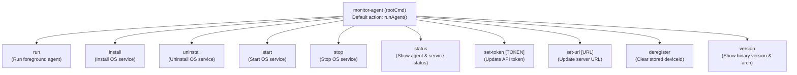

# Command-Line Interface (CLI) Forensics

## 1. Overview & Framework

The CLI is built using `github.com/spf13/cobra` in `monitor-agent/cmd/`. It shares the same compiled binary with the background daemon service.

When `monitor-agent` is executed interactively in a console, `main()` passes control to `cmd.Execute()`, evaluating command arguments and flags.

---

## 2. Command Hierarchy & Registration

All commands are registered to `rootCmd` in `cmd/root.go`:



---

## 3. Detailed Command Reference

### `monitor-agent` (root)
- **Syntax**: `monitor-agent`
- **Action**: Invokes `runAgent()`, identical to `monitor-agent run`.
- **Exit Code**: 0 on clean shutdown via SIGINT/SIGTERM, 1 on uncaught failure.

### `monitor-agent run`
- **Source**: `cmd/run.go`
- **Purpose**: Runs the monitoring agent in the foreground console attached to terminal stdout.
- **Arguments**: None.
- **Flags**: None.
- **Execution Flow**:
  1. Loads configuration from disk (`config.Load()`).
  2. Prints startup banner (`Server`, `Token`).
  3. Checks registration; calls `service.RegisterIfNeeded(cfg)` if `cfg.DeviceID == ""`. If registration fails, prints error and exits immediately.
  4. Creates `stop := make(chan struct{})`.
  5. Spawns `service.StartCommandLoop(cfg, stop)`.
  6. Spawns `service.StartMetricsWebSocketLoop(cfg, stop)`.
  7. Spawns `service.StartDetailedMetricsLoop(cfg, stop, 30*time.Second)`.
  8. Listens on `sigChan` for `os.Interrupt` (Ctrl+C) or `syscall.SIGTERM`.
  9. On signal receipt: closes `stop` channel, executes `time.Sleep(1 * time.Second)`, and exits.
- **Exit Codes**:
  - `0`: Normal shutdown.
  - `1`: Configuration failure or initial registration failure.

### `monitor-agent install`
- **Source**: `cmd/install.go`
- **Purpose**: Configures the agent credentials and installs the binary as an OS daemon service.
- **Flags**:
  - `--token <string>`: *(Required)* Company API token obtained from dashboard.
  - `--server <string>`: *(Optional)* Backend server URL (e.g. `http://localhost:8080`).
- **Execution Flow**:
  1. Validates `--token` flag. If empty, prints `"Token is required. Use --token."` and exits without error.
  2. Loads existing config or creates empty config.
  3. Updates `cfg.Token = token`.
  4. If `--server` is provided, updates `cfg.ServerURL = server`.
  5. Resets `cfg.DeviceID = ""` (forces fresh registration on next boot).
  6. Saves updated config to disk.
  7. Calls `service.ControlService("install")`, delegating to `kardianos/service` (registers systemd unit, Windows Service, or launchd plist).
  8. Prints `"Service installed. Use 'monitor-agent start' to run it."`

### `monitor-agent uninstall`
- **Source**: `cmd/uninstall.go`
- **Purpose**: Removes configuration and optionally removes the OS daemon service.
- **Flags**:
  - `--service` (bool, default `false`): If set, stops the running OS service and unregisters it.
- **Execution Flow**:
  1. If `--service` is set:
     - Calls `service.ControlService("stop")`.
     - Calls `service.ControlService("uninstall")`.
  2. Calls `config.Delete()`: deletes `config.json` from the filesystem.
  3. Prints `"Uninstall complete."`

### `monitor-agent start`
- **Source**: `cmd/start.go`
- **Purpose**: Signals the OS service manager to start the background service.
- **Execution Flow**:
  - Calls `service.ControlService("start")`.
  - Prints `"Service started."` or logs error on failure.

### `monitor-agent stop`
- **Source**: `cmd/stop.go`
- **Purpose**: Signals the OS service manager to stop the background service.
- **Execution Flow**:
  - Calls `service.ControlService("stop")`.
  - Prints `"Service stopped."` or logs error on failure.

### `monitor-agent status`
- **Source**: `cmd/status.go`
- **Purpose**: Displays the configuration file path, log path, server URL, token status, device ID, and service daemon state.
- **Execution Flow**:
  - Prints `Config path: ...`
  - Prints `Log path: ...`
  - Prints `Server: ...`
  - Prints `Token set: true/false`
  - Prints `Device ID: ...`
  - Queries OS service manager via `service.GetServiceStatus()` (`running`, `stopped`, or `unknown`).

### `monitor-agent set-token [TOKEN]`
- **Source**: `cmd/set_token.go`
- **Purpose**: Sets or rotates the company API token.
- **Arguments**: Exactly 1 argument required (`cobra.ExactArgs(1)`).
- **Execution Flow**:
  - Updates `cfg.Token = args[0]`.
  - Clears `cfg.DeviceID = ""` (forces re-registration under the new token's company).
  - Saves config to disk.

### `monitor-agent set-url [URL]`
- **Source**: `cmd/set_url.go`
- **Purpose**: Sets the target backend server URL.
- **Arguments**: Exactly 1 argument required (`cobra.ExactArgs(1)`).
- **Execution Flow**:
  - Updates `cfg.ServerURL = args[0]`.
  - Clears `cfg.DeviceID = ""` (forces re-registration with the new server).
  - Saves config to disk.

### `monitor-agent deregister`
- **Source**: `cmd/deregister.go`
- **Purpose**: Clears the stored device UUID locally so the agent registers as a new device on next startup.
- **Execution Flow**:
  - Updates `cfg.DeviceID = ""`.
  - Saves config to disk.
  - *Note*: Does NOT send a deregistration request to the backend. The backend device record remains in the database.

### `monitor-agent version`
- **Source**: `cmd/version.go`
- **Purpose**: Prints the compiled binary version, Go compiler version, and target OS/architecture.
- **Variables**: `var Version = "dev"` (injected via `go build -ldflags "-X monitor-agent/cmd.Version=$version"`).
- **Sample Output**:
  ```text
  Version: 0.1.1
  Go: go1.21.0
  OS/Arch: linux/amd64
  ```\n