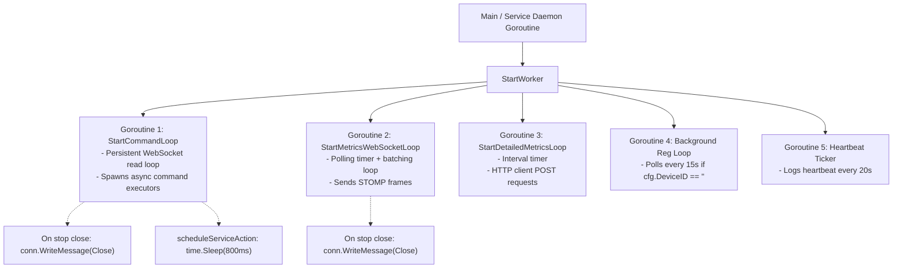

# Concurrency Models, Threading & Race Condition Analysis

## 1. Go Monitor Agent Concurrency Architecture

### Concurrency Primitives Discovered

| File | Primitive | Scope / Role | Producer / Writer | Consumer / Reader |
| :--- | :--- | :--- | :--- | :--- |
| `cmd/run.go` | `chan struct{}` (`stop`) | Broadcast termination signal | Signal handler (`close(stop)`) | Metrics loop, detail loop, command loop |
| `cmd/run.go` | `chan os.Signal` (`sigChan`) | OS signal notification | OS Kernel | Main goroutine (`<-sigChan`) |
| `service/service.go` | `chan struct{}` (`program.stop`)| OS daemon termination | SCM `Stop()` hook | `StartWorker` routines |
| `service/logs.go` | `sync.Mutex` (`agentLogState.mu`)| Log file offset cache | `readTail()` | Concurrent callers of `collectLogsSnapshot()` |
| `loadtester/internal/load/runner.go` | `sync.Mutex`, `sync.RWMutex` | Simulator state protection | Dynamic simulation workers | Metrics aggregators, reporting loops |

### Goroutine Tree & Lifecycle
When `service.StartWorker(stop)` is called, the following goroutines are active:



---

## 2. Race Condition Forensics

### Race Condition 1: Unsynchronized Mutation of Shared `*config.Config` Pointer
- **Severity**: Confirmed High Risk / Data Race
- **Code Path**:
  - `service/worker.go` passes the same pointer `cfg` to `StartCommandLoop(cfg, stop)`, `StartMetricsWebSocketLoop(cfg, stop)`, `StartDetailedMetricsLoop(cfg, stop)`, and the background registration goroutine.
  - In `service/metrics_ws.go:34`:
    ```go
    if cfg.DeviceID == "" {
        if err := RegisterIfNeeded(cfg); ...
    }
    ```
  - In `service/commands.go:67`:
    ```go
    if cfg.DeviceID == "" {
        if err := RegisterIfNeeded(cfg); ...
    }
    ```
  - In `service/worker.go:37`:
    ```go
    if cfg.DeviceID == "" {
        if err := RegisterIfNeeded(cfg); ...
    }
    ```
  - In `service/register.go:44`:
    ```go
    cfg.DeviceID = result.ID
    config.Save(cfg)
    ```
- **Hazard**: Three independent goroutines concurrently evaluate `cfg.DeviceID == ""` without a mutex. If all three observe empty strings simultaneously, all three send concurrent HTTP POST requests to `/agent/register`. When responses arrive, all three write to `cfg.DeviceID` and invoke `config.Save(cfg)` concurrently.
- **Race Detector**: `go test -race` will flag a data race on `cfg.DeviceID` writes.

### Race Condition 2: Detail Loop Memory Slice Mutation on Partial Failure
- **Severity**: Confirmed Resource Leak / Memory Growth
- **Code Path**: `service/metrics_detail_ws.go:52-59`
  ```go
  payload := collectDetailedMetricsPayload(cfg)
  if payload != nil {
      batch = append(batch, payload)
  }
  if len(batch) >= detailBatchSize || time.Since(lastFlush) >= detailBatchMaxWait {
      if err := sendDetailedMetricsBatch(cfg, batch); err != nil {
          logrus.Error("Failed to send detailed metrics batch:", err)
      } else {
          batch = batch[:0]
          lastFlush = time.Now()
      }
  }
  ```
  If `sendDetailedMetricsBatch` fails, `batch` retains the failed items. Each 30 seconds, an additional multi-megabyte payload is appended. The slice grows indefinitely during network disconnects.

---

## 3. Spring Boot Backend Concurrency Architecture

### Thread Pools & Execution Concurrency
1. **Embedded Tomcat Ingress Pool**:
   - Handles inbound HTTP REST and WebSocket upgrade requests.
   - Max threads: 200 (Default Spring Boot configuration).
2. **STOMP Inbound / Outbound Channels**:
   - `clientInboundChannel`: Worker pool handling STOMP frame dispatch.
   - `clientOutboundChannel`: Worker pool writing STOMP frames to client sockets.
   - Configured in `WebSocketConfig.java` with 4MB buffer limits and 30-second send time limits.
3. **Spring Scheduling Pool (`TaskScheduler`)**:
   - Single-threaded by default in Spring Boot without custom `TaskScheduler` bean.
   - Executes `DeviceStatusScheduler.checkOfflineDevices()` every 30s.
   - Executes `MetricsStorageService.enforceRetentionFallback()` at 02:30 daily.

### Backend Race Conditions & Thread Hazards

#### Hazard 1: `DeviceStatusScheduler` Full Table Iteration Lockout
- In `DeviceStatusScheduler.java:25`:
  `List<Device> devices = deviceRepository.findAll();`
- Runs every 30 seconds on a single scheduler thread. In a deployment with 20,000 devices, this query executes a massive table scan, deserializes 20,000 JPA entities, and sequentially writes updates for each offline device. If the execution duration exceeds 30 seconds, subsequent runs queue up or cause scheduler starvation.

#### Hazard 2: `DeviceService.detailedMetricsCache` Unbounded Growth
- In `DeviceService.java:34`:
  `private final Map<UUID, CachedDetails> detailedMetricsCache = new ConcurrentHashMap<>();`
- Device detail responses are cached with a 5000ms expiration check:
  `detailedMetricsCache.put(deviceId, new CachedDetails(now, response));`
- Entries are only updated when requested, but are **NEVER evicted**. Stale device UUID keys persist in JVM memory permanently.

---

## 4. Next.js Frontend Concurrency & React 19 State

### Asynchronous Operations & Race Shields
1. **Stomp Client Activation**:
   - Managed inside `useEffect` tied to `[deviceId]`.
   - On unmount or route change, `client.deactivate()` cancels underlying SockJS event listeners to prevent memory leaks and zombie subscriptions.
2. **Command Chunk Buffer Synchronization**:
   - Incoming chunks from `/topic/command-result/{deviceId}` arrive asynchronously.
   - Managed via a React `useRef<Map<string, CommandChunkBuffer>>(new Map())`.
   - `useRef` provides stable mutable storage outside the React render cycle, preventing re-render thrashing while chunk assembly takes place.\n