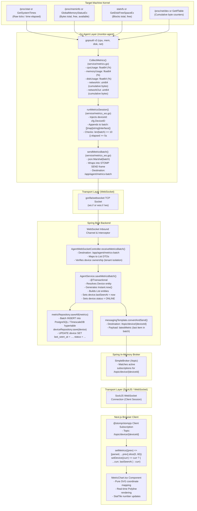
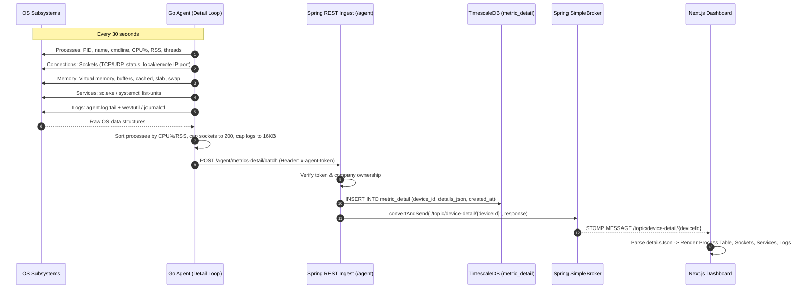

# End-to-End Data Flow & Metric Lineage

## 1. Complete Metric Lineage: Kernel to Visual Pixel

The diagram below traces the precise transformations of a telemetry metric across every layer of the architecture:



---

## 2. Deep Diagnostic Snapshot Data Lineage

The data flow for heavyweight system snapshots operates across REST and WebSocket:



---

## 3. Remote Command Execution Lineage

```mermaid
sequenceDiagram
    autonumber
    participant Operator as Browser UI (Operator)
    participant Broker as Spring SimpleBroker
    participant Agent as Go Agent (Command Loop)
    participant OS as Local Host Shell (sh/PowerShell)

    Operator->>Broker: SEND /app/command/{deviceId} {type: "shell", payload: "df -h"}
    Broker->>Broker: Verify companyId matches device owner
    Broker-->>Agent: MESSAGE /topic/agent/{deviceId}
    Agent->>Agent: Check blockedCommandPattern regex
    Agent->>OS: Execute with 30s timeout (PowerShell / sh)
    OS-->>Agent: Raw stdout & stderr bytes
    Agent->>Agent: Strip null bytes, split into <=12KB chunks
    loop For each chunk (0..N-1)
        Agent->>Broker: SEND /app/command-result {chunkIndex: i, chunkCount: N, status: "stream"}
        Broker-->>Operator: MESSAGE /topic/command-result/{deviceId}
        Operator->>Operator: Buffer chunk in memory & reassemble
    end
    Agent->>Broker: SEND /app/command-result {chunkIndex: N-1, status: "ok", finishedAt: timestamp}
    Broker-->>Operator: MESSAGE /topic/command-result/{deviceId}
    Operator->>Operator: Mark command finished, clear buffer, display complete output
```\n