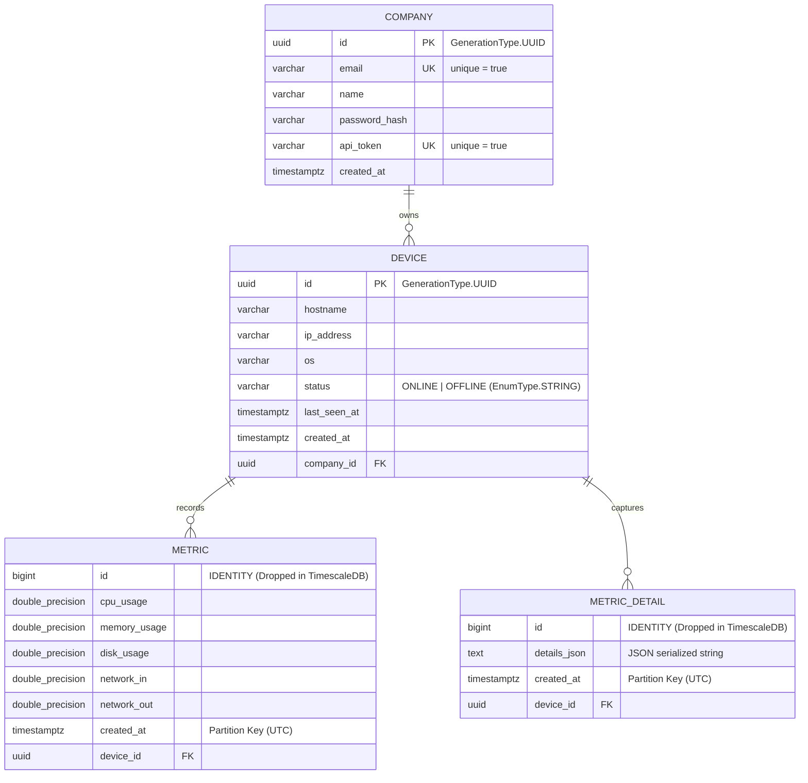

# Database Forensics, Schema & TimescaleDB Mechanics

## 1. Database Architecture & Engine

- **Database Engine**: PostgreSQL 16 with TimescaleDB 2.13.1 extension (`timescale/timescaledb:2.13.1-pg16`).
- **Connection Pool**: HikariCP (Spring Boot default).
- **ORM / Persistence**: Spring Data JPA / Hibernate 6.x.
- **DDL Mode**: `spring.jpa.hibernate.ddl-auto: update`.
- **Batch Processing Configuration** (`application.yml`):
  ```yaml
  spring:
    jpa:
      properties:
        hibernate:
          jdbc:
            time_zone: UTC
            batch_size: 100
            batch_versioned_data: true
          order_inserts: true
          order_updates: true
  ```

---

## 2. Relational Schema & Entity Contracts



---

## 3. TimescaleDB Hypertable Transformations

Hibernate initially creates standard PostgreSQL tables with primary key constraints on `id`. At startup, `MetricsStorageService.initializeStorage()` executes raw SQL DDL to transform the schema:

1. **Extension Initialization**:
   ```sql
   CREATE EXTENSION IF NOT EXISTS timescaledb;
   ```
2. **Column Type Alteration (`normalizeTimestampColumns`)**:
   Converts timestamp columns from `timestamp without time zone` to `TIMESTAMPTZ` at UTC:
   ```sql
   ALTER TABLE company ALTER COLUMN created_at TYPE TIMESTAMPTZ USING created_at AT TIME ZONE 'UTC';
   ALTER TABLE device ALTER COLUMN created_at TYPE TIMESTAMPTZ USING created_at AT TIME ZONE 'UTC';
   ALTER TABLE device ALTER COLUMN last_seen_at TYPE TIMESTAMPTZ USING last_seen_at AT TIME ZONE 'UTC';
   ALTER TABLE metric ALTER COLUMN created_at TYPE TIMESTAMPTZ USING created_at AT TIME ZONE 'UTC';
   ALTER TABLE metric_detail ALTER COLUMN created_at TYPE TIMESTAMPTZ USING created_at AT TIME ZONE 'UTC';
   ```
3. **Primary Key Dropping (`prepareMetricTablesForHypertables`)**:
   TimescaleDB requires that any primary key or unique constraint on a hypertable include the partitioning time column. Because Hibernate creates an auto-incrementing identity on `id` alone, `MetricsStorageService` dynamically drops the primary key constraint:
   ```sql
   ALTER TABLE metric DROP CONSTRAINT metric_pkey;
   ALTER TABLE metric_detail DROP CONSTRAINT metric_detail_pkey;
   ```
4. **Hypertable Creation**:
   ```sql
   SELECT create_hypertable('metric', 'created_at', if_not_exists => TRUE, migrate_data => TRUE);
   SELECT create_hypertable('metric_detail', 'created_at', if_not_exists => TRUE, migrate_data => TRUE);
   ```
5. **Compound Indexes**:
   ```sql
   CREATE INDEX IF NOT EXISTS idx_metric_device_created_at ON metric (device_id, created_at DESC);
   CREATE INDEX IF NOT EXISTS idx_metric_detail_device_created_at ON metric_detail (device_id, created_at DESC);
   ```
6. **Data Retention Policies**:
   ```sql
   SELECT add_retention_policy('metric', INTERVAL '30 days', if_not_exists => TRUE);
   SELECT add_retention_policy('metric_detail', INTERVAL '7 days', if_not_exists => TRUE);
   ```

---

## 4. Query Patterns & Performance Analysis

### Ingestion Query: Batch Insert of Metrics
- **Caller**: `AgentService.saveMetricsBatch(requests)`
- **JPA Call**: `metricRepository.saveAll(metrics)`
- **Execution**: Hibernate orders inserts and flushes in batches of 100 (`batch_size: 100`).
- **TimescaleDB Optimization**: Routed to the active chunk table for the current time bucket based on `created_at`.

### Dashboard Query: Latest 50 Metrics
- **Caller**: `DeviceController.getMetrics(deviceId)` -> `DeviceService.getMetrics(deviceId)`
- **JPA Method**: `metricRepository.findTop50ByDeviceOrderByCreatedAtDesc(device)`
- **SQL Generated**:
  ```sql
  SELECT m.* FROM metric m WHERE m.device_id = ? ORDER BY m.created_at DESC LIMIT 50;
  ```
- **Index Used**: Perfectly matched by `idx_metric_device_created_at (device_id, created_at DESC)`. Fast index scan without sorting overhead.

### Dashboard Query: Latest 20 Diagnostic Snapshots
- **Caller**: `DeviceController.getDetailedMetrics(deviceId)` -> `DeviceService.getDetailedMetrics(companyId, deviceId)`
- **JPA Method**: `metricDetailRepository.findTop20ByDeviceOrderByCreatedAtDesc(device)`
- **SQL Generated**:
  ```sql
  SELECT md.* FROM metric_detail md WHERE md.device_id = ? ORDER BY md.created_at DESC LIMIT 20;
  ```
- **Index Used**: Perfectly matched by `idx_metric_detail_device_created_at (device_id, created_at DESC)`.

### Offline Device Sweep Query
- **Caller**: `DeviceStatusScheduler.checkOfflineDevices()`
- **JPA Method**: `deviceRepository.findAll()`
- **SQL Generated**:
  ```sql
  SELECT d.* FROM device d;
  ```
- **Analysis**: Full table scan every 30 seconds. Does not filter by `status = 'ONLINE'` or `last_seen_at < threshold`. Performance will degrade as total fleet size grows.

---

## 5. Idempotency & Batch Duplication Analysis

> **Can the same monitoring batch be safely sent twice?**

- **Answer**: **NO. Ingestion is NOT idempotent.**
- **Reasoning from Source Code**:
  - The `metric` and `metric_detail` tables have **no unique constraints** or natural deduplication keys (such as `sample_uuid` or `(device_id, agent_timestamp)`).
  - When the agent sends a batch, the backend assigns the current server time `Instant.now()` to every item in the batch.
  - If a network timeout occurs while the agent waits for an HTTP 200 response, and the agent or client re-transmits the identical payload, the backend will treat it as a new batch and perform another set of `INSERT` statements.
  - Duplicate rows with identical CPU, memory, and disk values will be stored in the hypertable with slightly different `created_at` timestamps.\n