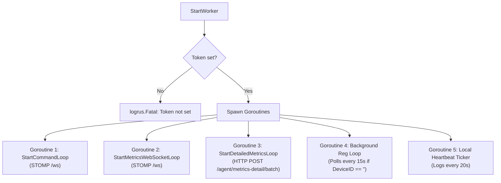

# Go Monitor Agent Forensics & Architecture

## 1. Package Structure & Entrypoints

The Go Monitor Agent is structured under the `monitor-agent/` module (`go 1.21`).

```text
monitor-agent/
├── cmd/                      # Cobra CLI command suite
│   ├── root.go               # Root command, CLI dispatcher
│   ├── run.go                # Foreground agent executor
│   ├── install.go            # OS service installation
│   ├── uninstall.go          # OS service uninstallation
│   ├── start.go              # Service start
│   ├── stop.go               # Service stop
│   ├── status.go             # Service & config status inspector
│   ├── set_token.go          # Provisioning company API token
│   ├── set_url.go            # Provisioning server URL
│   ├── deregister.go         # Clearing local device identity
│   └── version.go            # Build version reporting
├── config/
│   └── config.go             # Config load, save, delete, file paths
├── service/                  # Core agent background engine
│   ├── service.go            # kardianos/service lifecycle glue
│   ├── worker.go             # Supervisor spawning concurrent loops
│   ├── register.go           # Device registration HTTP client
│   ├── client.go             # Shared 10s timeout HTTP client
│   ├── metrics.go            # System metric collection (gopsutil)
│   ├── metrics_ws.go         # Adaptive STOMP WebSocket metrics batcher
│   ├── metrics_detail.go     # Process, connection, memory collectors
│   ├── metrics_detail_ws.go  # 30s HTTP REST batcher for detail snapshots
│   ├── stomp.go              # Custom lightweight STOMP frame parser & builder
│   ├── commands.go           # Remote command receiver & executor
│   ├── services.go           # OS service discovery (sc, systemctl, launchctl)
│   ├── logs.go               # Stateful agent log tail & system log fetcher
│   └── logger.go             # Logrus dual-writer (stdout + agent.log)
├── go.mod                    # Module dependencies
└── main.go                   # Single unified process entrypoint
```

### Main Entrypoint (`main.go`)

```go
func main() {
	service.InitLogger()
	if !appservice.Interactive() {
		service.RunService()
		return
	}
	cmd.Execute()
}
```

- When executed by an OS service manager (such as `systemd`, Windows SCM, or `launchd`), `appservice.Interactive()` evaluates to `false`. The process calls `service.RunService()`, which registers a `kardianos/service` interface and runs in non-interactive background mode.
- When executed from an interactive shell terminal, it calls `cmd.Execute()` to run the Cobra CLI parser.

---

## 2. Configuration System (`config/config.go`)

The agent stores configuration in a single JSON file.

### Configuration Struct
```go
type Config struct {
	ServerURL string `json:"serverUrl"`
	Token     string `json:"token"`
	DeviceID  string `json:"deviceId"`
}
```

### File Resolution Strategy (`getConfigPath()`)
1. **Environment Variable Override**: If `MONITOR_AGENT_CONFIG` is set, that exact file path is used.
2. **Windows Platform**: Resolves to `%ProgramData%\MonitorAgent\config.json` (defaults to `C:\ProgramData\MonitorAgent\config.json`).
3. **Linux / macOS**: Resolves to `$HOME/.monitor-agent.json`.
4. **Log Path**: Resolves to `agent.log` located in the same directory as `config.json`.

---

## 3. Worker Supervisor & Lifecycle (`service/worker.go`)

When the background service starts (`service.RunService()` -> `program.Start()` -> `StartWorker(stop)`), it initiates four distinct asynchronous routines:

1. `go StartCommandLoop(cfg, stop)`: Persistent STOMP WebSocket connection to `/ws` listening for administrative instructions.
2. `go StartMetricsWebSocketLoop(cfg, stop)`: Persistent STOMP WebSocket connection to `/ws` streaming time-series metrics.
3. `go StartDetailedMetricsLoop(cfg, stop, 30*time.Second)`: Periodic HTTP POST worker collecting deep diagnostic snapshots.
4. `go Background Registration Goroutine`: Retries registration every 15s if `cfg.DeviceID == ""`.
5. `go Heartbeat Logger Goroutine`: Emits a heartbeat message with device and server fields every 20s.



---

## 4. Live Metrics Engine & Adaptive Sampling (`service/metrics_ws.go`)

### Sampling Strategy
Metrics are collected locally via `CollectMetrics()`:
- `cpuUsage`: `gopsutil/v3/cpu.Percent(0, false)` (1-sample snapshot).
- `memoryUsage`: `gopsutil/v3/mem.VirtualMemory().UsedPercent`.
- `diskUsage`: `gopsutil/v3/disk.Usage("C:\\" or "/").UsedPercent`.
- `networkIn`: `gopsutil/v3/net.IOCounters(false)[0].BytesRecv` (raw total bytes).
- `networkOut`: `gopsutil/v3/net.IOCounters(false)[0].BytesSent` (raw total bytes).

### Adaptive Frequency Algorithm
The sleep duration after each sample is determined dynamically based on the current CPU load:
```go
func intervalForCpu(cpuValue interface{}) time.Duration {
	cpuUsage, ok := cpuValue.(float64)
	if !ok {
		return 5 * time.Second
	}
	if cpuUsage > 90 {
		return 1 * time.Second  // High load: tight 1-second sampling
	}
	if cpuUsage > 70 {
		return 2 * time.Second  // Moderate load: 2-second sampling
	}
	return 5 * time.Second      // Normal load: 5-second sampling
}
```

### Batching Thresholds
- **Batch Size Limit**: `metricsBatchSize = 10` items.
- **Time Window Limit**: `metricsBatchMaxWait = 5 * time.Second`.
- **Trigger**: Whichever condition is met first (`len(batch) >= 10 || time.Since(lastFlush) >= 5s`).
- **Destination**: `/app/agent/metrics-batch` via STOMP `SEND` frame.

---

## 5. Detailed System Snapshot Engine (`service/metrics_detail.go` & `metrics_detail_ws.go`)

Every 30 seconds, `StartDetailedMetricsLoop` captures an exhaustive diagnostic snapshot:

### 1. Process Metrics (`collectProcessMetrics()`)
- Queries all active PIDs using `gopsutil/v3/process.Processes()`.
- Captures: `pid`, `name`, `exe` (trimmed to 256 chars), `cmdline` (trimmed to 256 chars), `username`, `status`, `ppid`, `createTime`, `isRunning`, `threads`, `cpuPercent`, `memoryRssBytes`, `memoryVmsBytes`, `memoryPercent`, `ioReadBytes`, `ioWriteBytes`.
- **In-Memory Sort**: Sorted descending by `cpuPercent`; tied values sorted descending by `memoryRssBytes`.

### 2. Sockets & Connections (`collectConnections()`)
- Queries network sockets via `gopsutil/v3/net.Connections("all")`.
- Captures: `pid`, `family`, `type`, `status`, `local` (`ip`, `port`), `remote` (`ip`, `port`).
- **Hard Upper Bound**: Truncated to `maxConnectionEntries = 200` to prevent payload bloat.

### 3. Memory Subsystems (`collectMemoryDetails()`)
- Captures total, available, used, usedPercent, free, cached, buffers, active, inactive, shared, slab, pageTables, swapCached, sreclaimable, sunreclaim.
- Captures swap stats: `swapTotal`, `swapUsed`, `swapFree`, `swapUsedPercent`.

### 4. System Services (`collectServicesSnapshot()`)
- Windows: `sc query state= all` (capped at 32KB).
- Linux: `systemctl list-units --type=service --all --no-pager` (capped at 32KB).
- macOS: `launchctl list` (capped at 32KB).
- Command timeout: 5 seconds.

### 5. System & Agent Logs (`collectLogsSnapshot()`)
- **Agent Log**: Efficient stateful tail reader maintaining `lastSize` and file offset pointer in `agentLogCache` (reads up to 16KB).
- **System Log**:
  - Windows: `wevtutil qe System /c:50 /f:text /rd:true` + `wevtutil qe Application ...` (capped at 16KB).
  - Linux: `journalctl -n 200 --no-pager` (capped at 16KB).
  - macOS: `log show --last 10m --style compact` (capped at 16KB).

---

## 6. Remote Command Execution Engine (`service/commands.go`)

### Subscription & Routing
The agent opens a dedicated STOMP WebSocket session and subscribes to `/topic/agent/{deviceId}`.

### Supported Command Types
1. **`shell`**:
   - Security filter: Evaluates input against `blockedCommandPattern`:
     ```regexp
     (?i)\b(rm|remove-item|removeitem|del|erase|rmdir|rd|format)\b
     ```
     If matched, aborts execution immediately with `"blocked command detected"`.
   - Execution environment:
     - Windows: Launches `powershell.exe -NoProfile -ExecutionPolicy Bypass -Command ...` with `$OutputEncoding=[System.Text.UTF8Encoding]::new()`.
     - Linux/macOS: Launches `sh -c "<command>"`.
   - Timeout: Enforced via `context.WithTimeout(context.Background(), 30 * time.Second)`.
   - Null-byte sanitization: `strings.ReplaceAll(value, "\x00", "")`.
2. **`service`**:
   - Supports actions: `start`, `stop`, `restart`.
   - In service mode (`!appservice.Interactive()`):
     - `start`: Returns `"service already running"`.
     - `stop` / `restart`: Spawns async goroutine sleeping 800ms before calling `service.Control(s, action)` to allow response frame transmission before daemon termination.
3. **`diagnostics`**:
   - Generates immediate JSON snapshot of hostname, OS, Go version, and current metric counters.
4. **`collect-details`**:
   - Triggers an immediate execution of `sendDetailedMetricsNow()` out-of-band.

### Chunked Result Assembly
If combined stdout and stderr exceeds `maxCommandChunkBytes = 12 * 1024` (12KB), the result is split into indexed chunks:
- Each chunk is transmitted as a separate STOMP message to `/app/command-result`.
- Intermediate chunks have `status: "stream"` and empty `finishedAt`.
- The terminal chunk contains `status: "ok"` or `"error"` and timestamped `finishedAt`.

---

## 7. STOMP Protocol Implementation (`service/stomp.go`)

The agent includes a native, lightweight STOMP 1.2 implementation without external STOMP library dependencies:
- `parseStompFrames(payload string)`: Splits raw WebSocket text messages on null bytes (`\x00`), parses header lines, and extracts body.
- `sendStompFrame(conn, frame)`: Serializes command, headers, body, and terminating null byte (`\x00`) into a `websocket.TextMessage`.
- `waitForConnected(conn)`: Blocks reading frames until `CONNECTED` frame is parsed, or returns an error if `ERROR` frame is received.\n