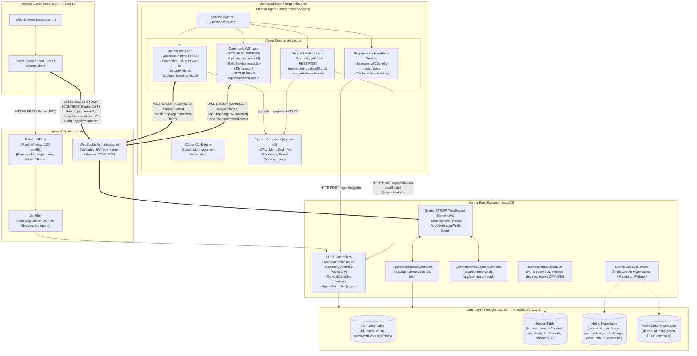

# System Overview — Monitor Agent Ecosystem

## Executive Summary

**Monitor Agent** is an end-to-end multi-tenant infrastructure monitoring and fleet management platform. The system operates across four primary layers:

1. **Go Monitor Agent (`monitor-agent/`)**: A cross-platform systems monitoring daemon running as a local background OS service (`kardianos/service`) or foreground CLI process. It performs live adaptive metric sampling (CPU, memory, disk, network) streamed via WebSocket/STOMP frames, collects comprehensive OS-level snapshots (processes, network connections, memory subsystems, system services, and raw logs) over HTTP REST, and listens for remote administrative commands (shell execution, service lifecycle control, diagnostics).
2. **Go Command-Line Interface (`monitor-agent/cmd/`)**: Built using `spf13/cobra`, integrated into the same unified binary, providing daemon control (`install`, `uninstall`, `start`, `stop`, `status`), token/endpoint provisioning (`set-token`, `set-url`), foreground execution (`run`), identity management (`deregister`), and binary version reporting (`version`).
3. **Spring Boot Backend (`backend/`)**: A Spring Boot 4.0.2 / Java 21 core engine serving REST endpoints, managing device registrations, ingesting metric and detail batches, providing rate limiting and JWT security, scheduling offline device detection, running TimescaleDB hypertable setups and retention cleanups, and hosting an in-memory STOMP/WebSocket message broker over `/ws`.
4. **Next.js Frontend (`frontend/`)**: A Next.js 16 (React 19) web dashboard using `@stomp/stompjs` and `sockjs-client` for real-time WebSocket metric visualization, device inventory search and status filtering, historical chart rendering, interactive process/connection/service/log snapshot exploration, and an interactive remote shell execution console with multi-part chunk reassembly.
5. **Go Load Tester (`loadtester/`)**: A high-concurrency simulation and stress-testing tool capable of provisioning virtual companies and devices, driving concurrent STOMP telemetry streams, dispatching remote commands, injecting chaos/network churn, and generating performance and latency reports.

---

## High-Level System Architecture

The following diagram reflects the verified runtime topology reconstructed from source code:

---

## Subsystem Inventory & Summary

| Subsystem | Directory | Language / Framework | Runtime Entry Point | Primary Responsibility |
| :--- | :--- | :--- | :--- | :--- |
| **Go Monitor Agent** | `monitor-agent/` | Go 1.21 (`github.com/shirou/gopsutil/v3`, `gorilla/websocket`) | `main.go` | System metric polling, process/connection snapshotting, remote command execution, STOMP/HTTP transmission. |
| **Go Agent CLI** | `monitor-agent/cmd/` | Go 1.21 (`github.com/spf13/cobra`) | `cmd/root.go` | CLI commands for service installation, start/stop, status checking, URL/token provisioning, manual run. |
| **Spring Boot Backend** | `backend/` | Java 21 / Spring Boot 4.0.2 / Spring Security / Spring Data JPA | `MonitorToolApplication.java` | REST API, STOMP WebSocket broker, authentication (JWT + API token), rate limiting, TimescaleDB hypertable setup, offline detection scheduler. |
| **Next.js Frontend** | `frontend/` | TypeScript / Next.js 16.1.6 / React 19.2.3 / Tailwind CSS v4 | `app/layout.tsx` | Live dashboard UI, real-time charts, detailed system views (processes, sockets, services, logs), remote command terminal. |
| **Load Tester** | `loadtester/` | Go 1.21 (`gorilla/websocket`, `stomp`) | `cmd/loadtester/main.go` | Synthetic fleet generator, multi-company/multi-device stress testing, metric stream generation, command latency benchmarking. |
| **Automation Scripts** | `scripts/` | Bash, PowerShell | `scripts/*.sh`, `scripts/*.ps1` | Agent build with version injection (`-ldflags`), multi-platform cross-compilation, automated installation, GitHub release tagging. |

---

## Key Architectural Principles & Invariants Discovered in Source

1. **Dual-Transport Ingestion**:
   - High-frequency time-series metrics (CPU, memory, disk, network) are batched (size: 10, max wait: 5s) and pushed over **WebSocket STOMP** (`/app/agent/metrics-batch`).
   - Heavyweight diagnostic snapshots (processes, connections, memory details, system service table, agent + system logs) are sent over **HTTP REST** (`/agent/metrics-detail/batch`) on a 30-second interval.
2. **Unified Agent Binary & Execution Mode Splitting**:
   - The Go agent executable uses `kardianos/service.Interactive()` at startup. When invoked interactively from a terminal, it delegates to Cobra CLI commands. When launched by an OS service manager (systemd, Windows SCM, launchd), it runs the background worker daemon.
3. **Decoupled Registration & Connection Lifecycles**:
   - The agent does not block service startup if the backend is down during boot. The worker initiates metric and command loops immediately, which dynamically sleep and poll `RegisterIfNeeded()` until a valid `deviceId` is acquired.
4. **Single-Node In-Memory STOMP Broker**:
   - The backend runs Spring's built-in `SimpleBroker` prefixing `/topic`. WebSocket messages are routed entirely in JVM memory. Horizontal scaling requires either external broker relay (e.g. RabbitMQ) or sticky sessions with a clustered message bus.
5. **TimescaleDB Integration with Graceful Relational Fallback**:
   - On boot, `MetricsStorageService` inspects PostgreSQL, alters timestamp columns to `TIMESTAMPTZ`, creates hypertables for `metric` and `metric_detail`, and applies native chunk retention policies (30 days for metrics, 7 days for details). If TimescaleDB is absent, it gracefully degrades to standard PostgreSQL tables and schedules a daily deletion cron job at 02:30 UTC.\n