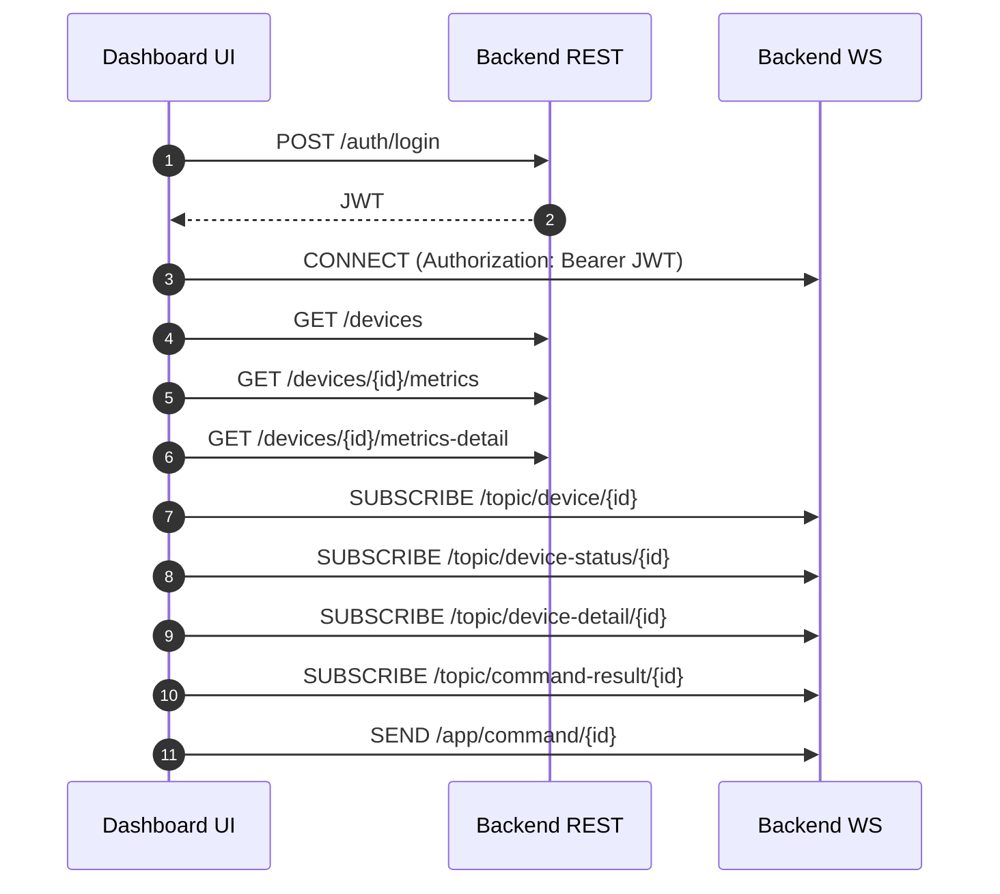

# Monitor Tool Frontend

Next.js dashboard for the monitoring platform. It provides authentication flows, device inventory, live metrics charts, detailed snapshots, and remote command execution.

## Features (current)

- Company registration and login flows.
- Dashboard with device search, auto-refresh, and status counts.
- Device detail view with live metrics charts and status streaming.
- Remote commands: shell, service control, diagnostics, collect-details.
- Command result history with chunked output assembly.
- Detailed metrics for processes, connections, services, and logs.
- Agent registration screen for quick onboarding.
- Company profile screen for API token management.

## Routes and screens

| Route                 | Screen             | Description                                                    |
| --------------------- | ------------------ | -------------------------------------------------------------- |
| `/`                   | Redirect           | Sends users to `/dashboard` or `/login` based on JWT presence. |
| `/login`              | Sign in            | Authenticates and stores JWT.                                  |
| `/register`           | Company signup     | Creates company and shows API token.                           |
| `/dashboard`          | Device overview    | Device cards, search, auto-refresh.                            |
| `/devices/[deviceId]` | Device detail      | Live metrics, commands, detailed snapshots.                    |
| `/company`            | Company profile    | View/copy stored API token.                                    |
| `/agents`             | Agent registration | Register a device with API token.                              |

## Data flow



## WebSocket topics used

- `/topic/device/{deviceId}` live metric samples.
- `/topic/device-status/{deviceId}` online/offline state changes.
- `/topic/device-detail/{deviceId}` detailed snapshot stream.
- `/topic/command-result/{deviceId}` command output and status.

Commands are sent to `/app/command/{deviceId}` with a generated `commandId`. Chunked results are reassembled in the UI before display.

## Getting started

```bash
bun install
bun dev
```

The app runs on `http://localhost:3000`.

You can also use npm:

```bash
npm install
npm run dev
```

## Environment variables

```env
NEXT_PUBLIC_API_BASE=http://localhost:8080
NEXT_PUBLIC_WS_URL=http://localhost:8080/ws
```

## Auth and storage

- JWT is stored in `localStorage` under the key `monitor.jwt`.
- Company profile (including API token) is stored in `localStorage` under `monitor.company`.
- WebSocket CONNECT uses the same JWT in the `Authorization` header.

## Detail view behavior

- The overview tab renders the last 60 metric samples in charts.
- The detailed tab refreshes snapshot history every 15 seconds.
- The command panel supports shell and service commands, plus diagnostics and on-demand detail collection.

## Relevant files

- [lib/api.ts](lib/api.ts) fetch helper and auth header attachment
- [lib/auth.ts](lib/auth.ts) local storage helpers
- [app/(dashboard)/devices/[deviceId]/page.tsx](<app/(dashboard)/devices/[deviceId]/page.tsx>) live streams and commands
